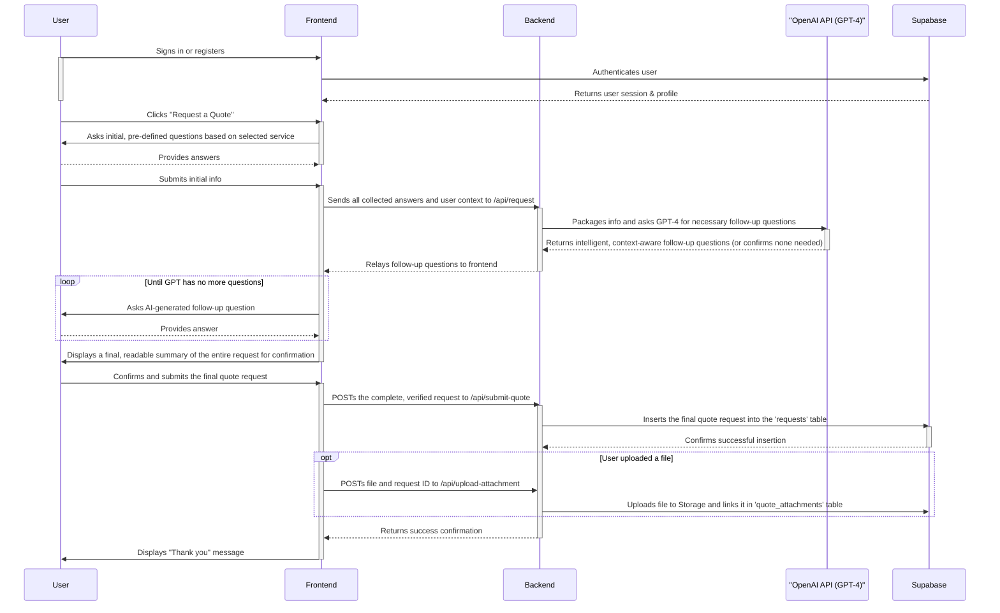

# PlumbingPOC: Fullstack AI-Powered Quoting & Lead Intake Platform

**PlumbingPOC** is a modern, fullstack proof-of-concept for a local trades business. It features a responsive Vite + React (TypeScript/TSX) web application, a modular backend API (Express/Node), and deep integrations with OpenAI and Supabase for intelligent agent functionality and data persistence.

The platform's core innovation is an **AI-powered quoting agent** that replaces traditional contact forms with an intelligent, guided intake process. This agent expertly qualifies leads, gathers all necessary job details, and even handles file attachments, ensuring that every quote request delivered to the business is high-quality, actionable, and ready for an accurate quote.

## Features

-   **Modern Frontend:** A fully responsive web app built with Vite, React, and Tailwind CSS (TypeScript/TSX).
-   **Intelligent Quoting Agent:** A guided, conversational modal that uses expert logic and dynamic, AI-generated questions to qualify leads.
-   **Robust Backend:** An Express/Node API that securely handles OpenAI GPT integration, Supabase data operations, and file uploads.
-   **Secure Database & Auth:** Full integration with Supabase for user profiles, quote requests, file storage, and secure authentication (Email/Password, Google, and Azure/Microsoft).
-   **Modular & Scalable:** Architected for easy iteration, with a clear separation of frontend, backend, and agent logic.

## Project Structure

The repository is organized for clarity and maintainability:

```
.
├── PROMPTS/                  # Prompt engineering & agent logic
├── vite-app/
│   ├── public/               # Static assets (images, etc.)
│   ├── src/                  # Frontend React application (TSX)
│   ├── api/                  # Backend API (Express/Node)
│   ├── SUPABASE_DATABASE_AND_AUTH_SETUP.md # Full setup guide for Supabase
│   └── ...                   # Vite config, etc.
├── blueprint.md              # The original "Operation Overmatch" strategic plan
└── startup.sh                # Convenience script for local development
```

---

## Local Development & Setup

### 1. Prerequisites

-   Node.js (v18 or higher)
-   npm (or yarn/pnpm)
-   A Supabase account (free tier is sufficient)
-   An OpenAI API key

### 2. Initial Setup

1.  **Clone the repository:**
    ```sh
    git clone [your-repo-url]
    cd PlumbingPOC
    ```

2.  **Configure Supabase:**
    Follow the detailed instructions in `vite-app/SUPABASE_DATABASE_AND_AUTH_SETUP.md` to set up your database tables, Row Level Security (RLS) policies, storage bucket, and authentication providers (Google, Azure).

3.  **Set Up Environment Variables:**
    Navigate to the `vite-app/` directory, copy the `.env.example` file to a new file named `.env`, and fill in your Supabase and OpenAI API keys.

4.  **Install Dependencies:**
    ```sh
    cd vite-app
    npm install
    ```

### 3. Running the Application

For the application to function correctly, **both the backend API and the frontend server must be running simultaneously.** The frontend proxies all `/api` requests to the backend.

#### Recommended Method: Startup Script

A convenient `startup.sh` script is included to automate the process and check for port conflicts.

```sh
# From the project root directory
./startup.sh
```

This script will start both services in the background and provide you with the URLs. It will also give you a command to stop both services when you're done.

#### Manual Method

1.  **Start the Backend API Server:**
    In your first terminal, from the `vite-app/` directory:
    ```sh
    npm run start:api
    ```
    The API will start, typically on `http://localhost:3001`.

2.  **Start the Frontend Vite Server:**
    In a second terminal, from the `vite-app/` directory:
    ```sh
    npm run dev
    ```
    The frontend will start, typically on `http://localhost:5173`.

3.  **Access the App:**
    Open your browser and navigate to `http://localhost:5173`.

---

## The AI Quoting Flow

The intelligent agent is the core of this POC. Here's how it works:



