# Copilot for Trades — AI-Powered OS for Local Service Businesses

**Copilot for Trades** is an AI-enabled web app I built to automate the unglamorous, time-consuming parts of running a local trade business (plumbing, electrical, HVAC, etc.). It turns a simple website form into a **conversational intake**, centralizes **job & quote management**, auto-generates **invoices**, and supports **SMS notifications** — all in one place.

> 🧑‍💻 **Built by:** *Richard Fremmerlid* — IT professional & AI systems builder based in Victoria, BC.
> 🌐 Live demo: https://copilotfortrades.com/
> 📹 5-minute walkthrough: https://www.loom.com/share/1ead7162412140bea1f46988af675adf

---

## ✨ Highlights

- **🧠 Conversational Lead Intake** — An AI assistant collects the right details (and photos) to qualify leads without phone tag.
- **📋 Command Center Dashboard** — Track every request from first contact → quote → scheduled → completed → **paid**.
- **📍 Map-Based View** — See all active jobs on a map to plan efficient routes.
- **💬 Realtime Notes & Updates** — Admin ↔ customer messages update instantly.
- **🧾 Invoice Automation** — Create invoices (and mark them paid) directly from the job flow; optional online payments.
- **📲 SMS Alerts** — Get a text the moment a new lead arrives (be first to respond = win more jobs).

> This is a working prototype designed for local trades — but the architecture fits any service business that needs quoting, scheduling, and billing.

---

## 📸 Application Showcase

### 🧩 Customer Quote Request Flow

Below are screenshots demonstrating how customers interact with the AI-powered quote assistant.

| Step | Description | Screenshot |
|------|--------------|-------------|
| 1️⃣ | AI assistant greeting & emergency prompt | 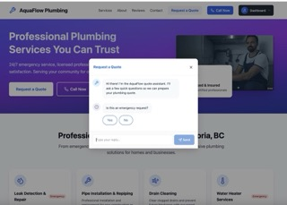 |
| 2️⃣ | Property and ownership questions | 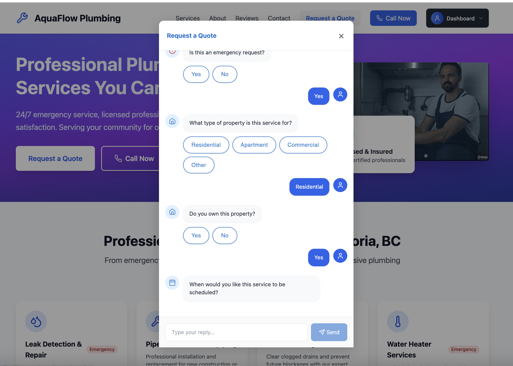 |
| 3️⃣ | Access and drainage problem details | 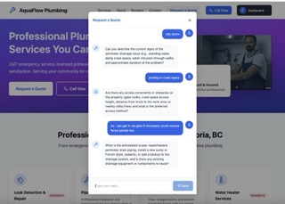 |
| 4️⃣ | Review and confirmation summary | 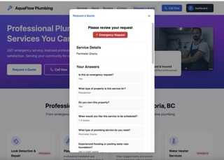 |
| 5️⃣ | Service location and contact confirmation | 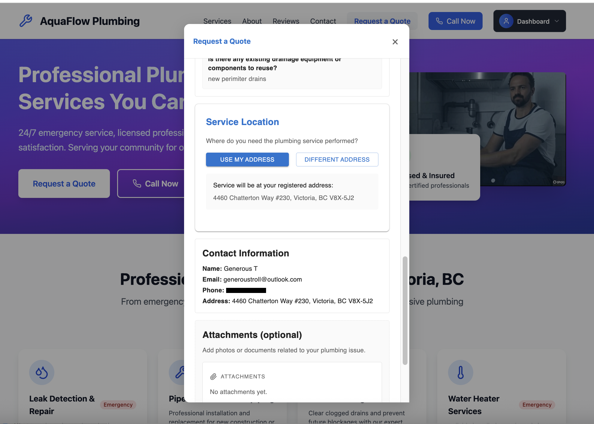 |

---

### 🧰 Admin Command Center

The following screenshots highlight the internal workflow for trades professionals managing jobs, quotes, and communications.

| Step | Description | Screenshot |
|------|--------------|-------------|
| 1️⃣ | Dashboard overview (job pipeline) | 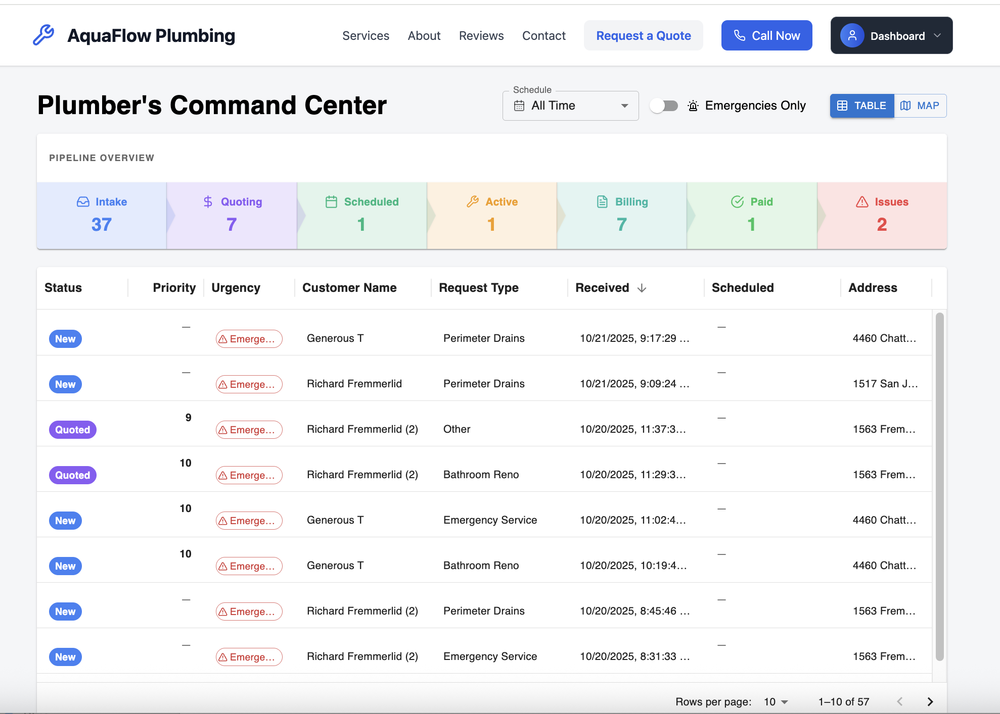 |
| 2️⃣ | Populated dashboard with multiple active jobs | 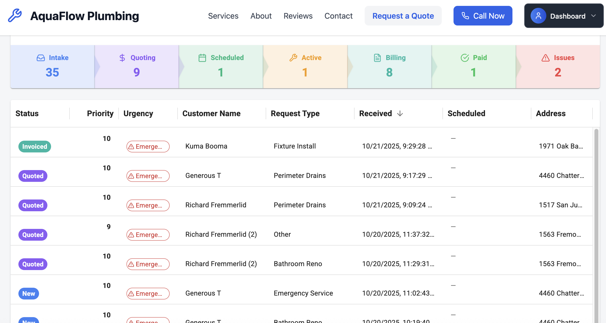 |
| 3️⃣ | Job Docket — reported problem details | 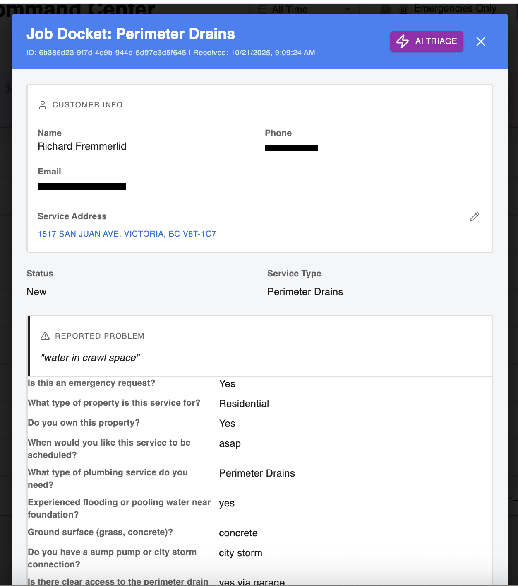 |
| 4️⃣ | AI triage summary (urgency and job classification) | 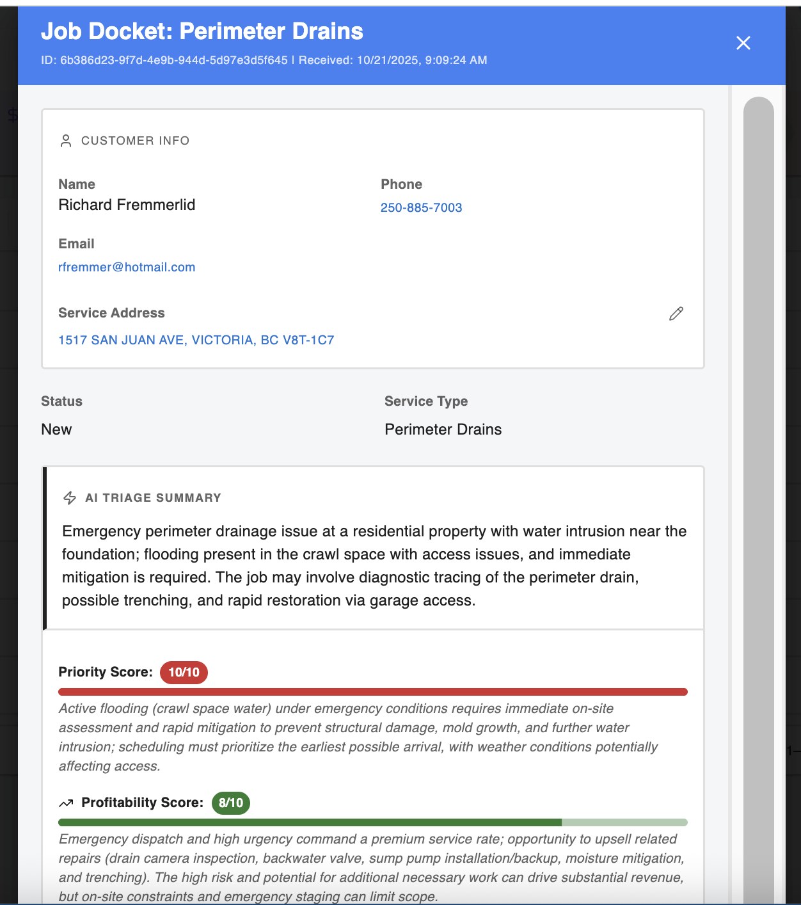 |
| 5️⃣ | Profitability and required expertise analysis | 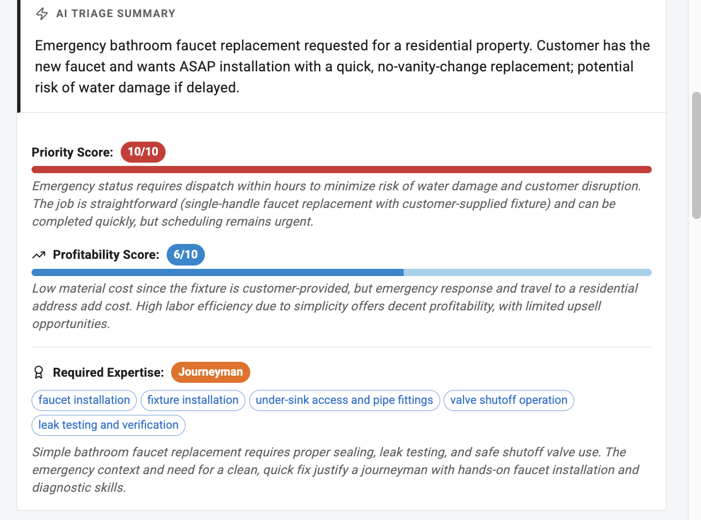 |
| 6️⃣ | Communication log (contractor notes) | 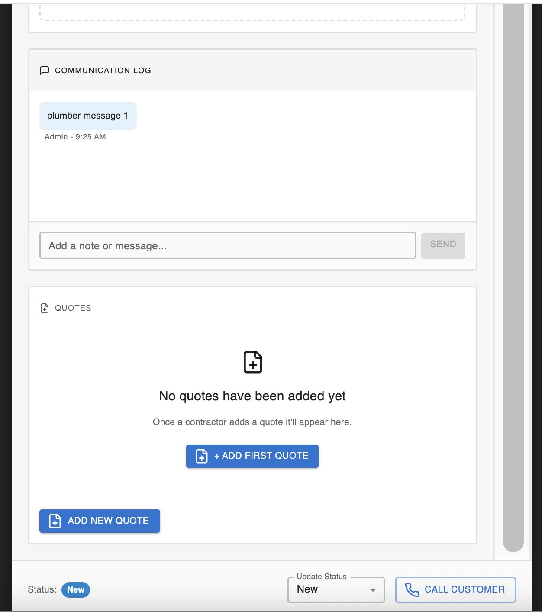 |
| 7️⃣ | Create new quote (labor & materials input) | 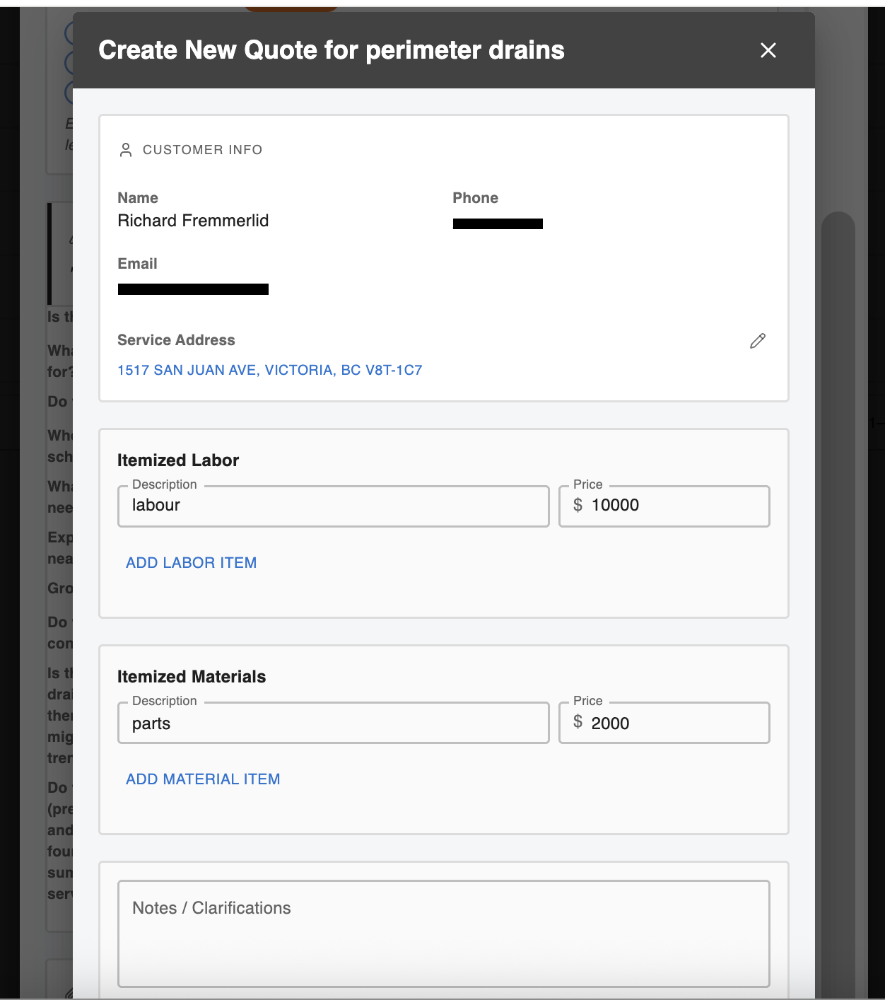 |
| 8️⃣ | Saved quote summary with taxes and expiry | 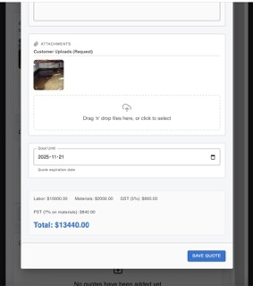 |
| 9️⃣ | Map view — route optimization and job clustering | 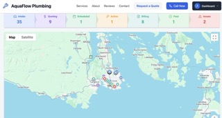 |
| 🔟 | SMS alert received via Twilio (instant notification) | 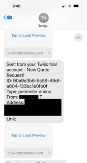 |

---

### 🏁 Notes
- Ensure images render correctly in GitHub preview.
- Use absolute paths starting with `docs/screenshots/` (no `./` prefix).
- Add a horizontal divider before this section for clarity (`---`).
- Do **not** alter any other existing README content.

---

## 🧭 Architecture at a Glance

- **Frontend:** React + Vite (TypeScript)
- **Backend:** Node.js / Express (server routes & API)
- **Serverless:** Netlify Functions for agent endpoints
- **Database & Realtime:** Supabase (auth, tables, storage, realtime)
- **AI:** OpenAI Models (conversational intake, triage, structured outputs)
- **Agents:** YAML-defined workflows (quote intake & triage) interpreted by lightweight runners


Frontend (React) → API (Express) → Netlify Functions (Agents)
↑ ↓ ↓
Supabase Auth ← Supabase DB/Realtime ← AI (OpenAI)


- YAML-driven agents keep workflows **transparent and editable** without code changes.
- Realtime updates propagate UI changes instantly (new notes, status changes, etc.).

> ⚙️ Want the deep dive? See: [INTERNAL_DEV_README.md](./INTERNAL_DEV_README.md) for setup, environment variables, and deployment notes.

---

## 🚀 Quick Start (Local)

> Minimal steps; full setup (Supabase, env) lives in **INTERNAL_DEV_README.md**.

```bash
git clone https://github.com/<your-username>/copilot-for-trades.git
cd copilot-for-trades
npm install
# start backend & frontend dev servers (see package.json scripts)
npm run dev


Configure your .env for Supabase & OpenAI (details in INTERNAL_DEV_README.md).

Open the frontend URL (usually http://localhost:5173).

🧩 Why I Built This

I wanted to see if modern AI + realtime web tech could remove the admin drag that local trades shoulder every day. The result is a working system that captures leads conversationally, keeps owners on top of every job, and gets invoices out (and paid) faster.

I’m sharing this publicly to:

Help others learn from (and build on) a real, end-to-end AI application.

Invite thoughtful collaboration and adaptation to other service industries.

Document the practical lessons from applying AI to small-business workflows.

📄 License & Contact

License: MIT © 2025 Richard Fremmerlid

Contact: richard.fremmerlid@gmail.com

Location: Victoria, BC

Need a managed/hosted version or a custom adaptation for another service industry? Reach out.

---

## 📜 License

This project is licensed under the **Creative Commons Attribution 4.0 International License (CC BY 4.0)**.
You are free to use, modify, and distribute this project — even commercially — as long as proper credit is given.

**Attribution requirement:**
"Created by [Richard Fremmerlid](https://github.com/richardfremmerlid) — Copilot for Trades (https://copilotfortrades.com)"

© 2025 Richard Fremmerlid
[View full license →](https://creativecommons.org/licenses/by/4.0/)


---

# What screenshots to create (exact shots & filenames)

Create these as **PNG**, 1440×900 (or your native display width), in **dark or light** theme — just be consistent. Blur/redact any personal info. Save into `docs/screenshots/` with the exact filenames below.

1) **Dashboard overview**
   - File: `dashboard_overview.png`
   - What: Main admin dashboard showing multiple requests across statuses (New, Quoted, Scheduled, Completed, Paid). Include a visible count or badges if available.

2) **Quote agent modal (intake)**
   - File: `quote_agent_modal.png`
   - What: The conversational intake UI mid-flow (a question with options or a photo upload prompt). Make the “AI is helping” feel obvious.

3) **AI triage summary card**
   - File: `triage_summary_card.png`
   - What: Show the triage scores (priority/profitability) and the summarized explanation for a request.

4) **Job docket modal / request detail**
   - File: `job_docket_modal.png`
   - What: The detailed view for a single request (history, notes, attachments, status controls).

5) **Map view (active jobs)**
   - File: `map_view.png`
   - What: The interactive map with multiple pins around your region. Include at least one selected pin with its info tooltip (if available).

6) **Invoice flow**
   - File: `invoice_flow.png`
   - What: The invoice creation/edit screen OR the invoice preview, plus the “Mark Paid” action (if present).

7) **SMS notification example**
   - File: `sms_notification.png`
   - What: A screenshot of an actual/placeholder SMS alert on a phone simulator or web preview (“New lead received…”).

8) **Customer intake flow (public site)**
   - File: `customer_intake_flow.png`
   - What: The public-facing quote request page (before login) or the first step of the intake conversation from a customer’s view.

> Pro tips
> - Use seed/demo data that looks realistic (“Leaking faucet in Fernwood”, “Hot water tank replacement”).
> - Make sure timestamps, badges, or progress indicators are visible — they communicate “live system” instantly.
> - Keep browser UI minimal (hide bookmarks bar; full-window the app).
> - If possible, keep a consistent primary color/brand through all screenshots for cohesion.

---

# Optional: Kilo Code AI prompts (to speed up)

- **Rename & split READMEs**
  > “Rename README.md to INTERNAL_DEV_README.md. Create a new root README.md using the public template I provide. Ensure all internal setup sections remain only in INTERNAL_DEV_README.md and link to it from README.md.”

- **Insert screenshot gallery**
  > “Create `docs/screenshots/` if missing and add markdown gallery in README.md under a ‘📸 App Snapshots’ section. Use the exact filenames: dashboard_overview.png, quote_agent_modal.png, triage_summary_card.png, job_docket_modal.png, map_view.png, invoice_flow.png, sms_notification.png, customer_intake_flow.png.”

- **Author metadata**
  > “Add my author name ‘Richard Fremmerlid’ to README.md footer and set the license to MIT with the current year.”

---

If you want, I can also generate a tiny `docs/ARCHITECTURE.md` to link from the README (1-page diagram + bullets) — just say the word and I’ll draft it.
