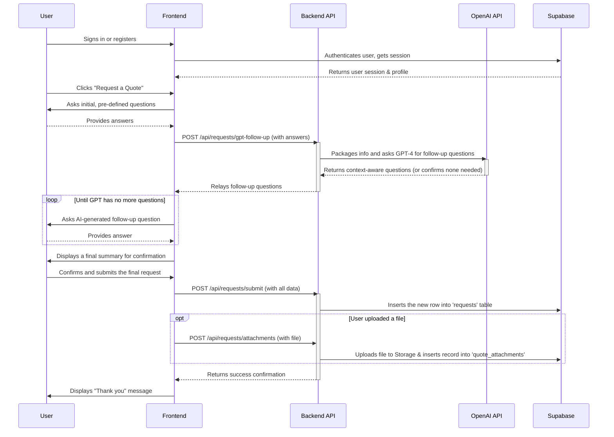
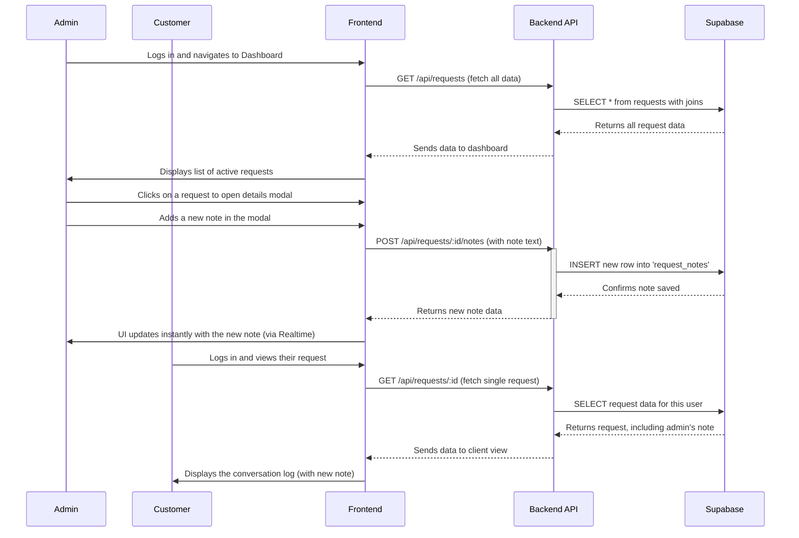
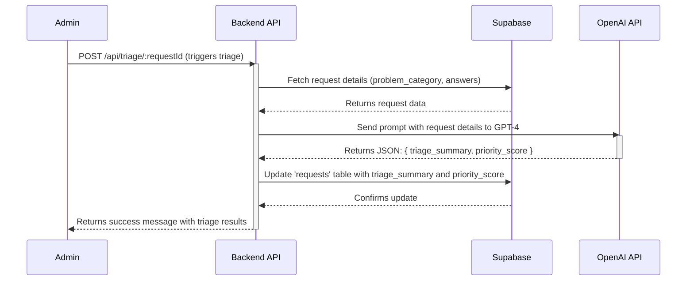

# PlumbingPOC: AI-Powered Client Management & Quoting Platform

**PlumbingPOC** is an end-to-end, fullstack client management and quoting platform built for local trades businesses. It transforms the initial point of contact from a simple form into an intelligent, AI-driven conversation, and extends into a full client portal for managing the entire job lifecycle.

Beyond intelligent lead qualification, it provides a secure command center for business owners to manage job statuses, create quotes, and communicate directly with clients in real-time. The platform features a responsive Vite + React frontend, a scalable MVC-patterned Node.js/Express backend, and deep integrations with OpenAI and Supabase for its core functionality.

## Features

-   **Modern Frontend:** A fully responsive web app built with Vite, React (TypeScript/TSX), and Tailwind CSS, architected with a professional, feature-based structure.
-   **Intelligent Quoting Agent:** A guided, conversational modal that uses expert logic and dynamic, AI-generated questions to ensure every lead is perfectly qualified.
-   **Scalable MVC Backend:** A robust Express/Node API architected for maintainability, featuring separate layers for routing, controllers, middleware, and validation.
-   **Secure Database & Auth:** Full integration with Supabase for user profiles, requests, quotes, notes, file storage, and secure authentication (Email/Password, Google, and Azure/Microsoft).
-   **Comprehensive Admin Dashboard:** A "Command Center" for business owners to view, manage, and act on all incoming quote requests in a professional, interactive UI.
-   **Interactive Job Management:** Update the status of any job (`new`, `quoted`, `scheduled`, `completed`) directly from the dashboard.
-   **Real-time Communication Log:** A live chat interface allowing admins and customers to communicate directly within a job's context, with messages appearing instantly for both parties.
-   **AI-Powered Triage:** With one click, admins can generate an AI summary, priority score, and profitability analysis for any new request, enabling them to focus on the most valuable jobs first.

## Project Structure

The repository follows a modern monorepo architecture with separate packages for frontend and backend services, organized for clarity and professional development standards.

```
.
├── packages/
│   ├── frontend/         # React/Vite application
│   │   ├── src/          # React components and logic (TSX)
│   │   │   ├── features/ # Feature-based architecture
│   │   │   │   ├── auth/
│   │   │   │   ├── profile/
│   │   │   │   └── requests/ # Components, hooks, and types co-located
│   │   │   └── lib/      # Shared libraries (Supabase client, API client)
│   │   ├── public/       # Static assets (images, etc.)
│   │   ├── index.html    # Main HTML template
│   │   ├── vite.config.js
│   │   └── package.json  # Frontend dependencies
│   └── backend/          # Node.js/Express API
│       ├── api/          # Express server and routes
│       │   ├── controllers/
│       │   ├── middleware/
│       │   ├── routes/
│       │   ├── services/
│       │   └── server.js
│       ├── netlify/
│       │   └── functions/ # Serverless functions
│       └── package.json  # Backend dependencies
├── PROMPTS/              # Prompt engineering & agent logic
├── supabase/
│   └── SUPABASE_DATABASE_AND_AUTH_SETUP.md # Full setup guide
├── package.json          # Root workspace configuration
└── ...
```

---

## Local Development & Setup

### 1. Prerequisites

-   Node.js (v20 or higher recommended)
-   npm (or yarn/pnpm)
-   A Supabase account (free tier is sufficient)
-   An OpenAI API key

### 2. Initial Setup

1.  **Clone the repository:**
    ```sh
    git clone [your-repo-url]
    cd PlumbingPOC
    ```

2.  **Configure Supabase:**
    Follow the detailed instructions in `supabase/SUPABASE_DATABASE_AND_AUTH_SETUP.md`. This guide contains the master SQL script to create all tables, set up the real-time publications, and apply the necessary Row Level Security (RLS) policies.

3.  **Set Up Environment Variables:**
    From the project root, create a copy of `.env.example` named `.env`, and fill in your Supabase and OpenAI API keys.

4.  **Install Dependencies:**
    ```sh
    npm install
    ```
    This will install dependencies for all packages in the workspace.

### 3. Running the Application

Both the backend API and the frontend server must be running simultaneously.

#### Recommended Method: Startup Script

From the project root directory, run the convenience script:
```sh
./startup.sh
```
This script will start both services in the background and provide you with the URLs.

#### Manual Method

1.  **Start the Backend API Server:**
    From the project root directory:
    ```sh
    npm run dev:backend
    ```

2.  **Start the Frontend Vite Server:**
    In a second terminal, from the project root directory:
    ```sh
    npm run dev:frontend
    ```

3.  **Access the App:**
    Open your browser and navigate to the frontend URL provided by Vite (usually http://localhost:5173).

---

## Application Flows

### 1. The AI-Powered Intake Flow
This diagram illustrates the initial, intelligent lead qualification process.



### 2. The Client & Admin Management Flow

This diagram shows how admins and clients interact with a request after it has been submitted.



### 3. The AI-Powered Triage Process

This shows the backend process for automatically analyzing a new request.



### 4. Real-time Publish/Subscribe Synchronization

This diagram illustrates how a message sent by one user appears instantly for another, using the Pub/Sub pattern.

```mermaid
sequenceDiagram
    participant Admin's Browser (Client A)
    participant Customer's Browser (Client B)
    participant Supabase Realtime Server
    participant Postgres Database

    Note over Admin's Browser (Client A), Customer's Browser (Client B): Pre-condition: Both users are viewing the same Job Docket.
    Note over Admin's Browser (Client A), Customer's Browser (Client B): The `useRequests` hook has already subscribed both clients to the channel.

    Admin's Browser (Client A)->>+Postgres Database: 1. User sends message (API call -> INSERT new note)
    Postgres Database-->>-Admin's Browser (Client A): API Response (OK)

    Postgres Database->>+Supabase Realtime Server: 2. [Publication] A change was detected in the `request_notes` table.
    
    Note over Supabase Realtime Server: Routing Logic!
    Supabase Realtime Server->>Supabase Realtime Server: 3. Check subscribers for the relevant channel. Found: Client A, Client B.

    Supabase Realtime Server->>+Admin's Browser (Client A): 4. [WebSocket Push] Broadcast new data payload
    Admin's Browser (Client A)->>Admin's Browser (Client A): 5. `useRequests` hook re-fetches data & UI refreshes
    deactivate Admin's Browser (Client A)

    Supabase Realtime Server->>+Customer's Browser (Client B): 4. [WebSocket Push] Broadcast new data payload
    Customer's Browser (Client B)->>Customer's Browser (Client B): 5. `useRequests` hook re-fetches data & UI refreshes
    deactivate Customer's Browser (Client B)
    
    deactivate Supabase Realtime Server
```# Test commit to trigger Netlify deployment
# Force deployment trigger - Thu Oct  9 07:47:11 PDT 2025
