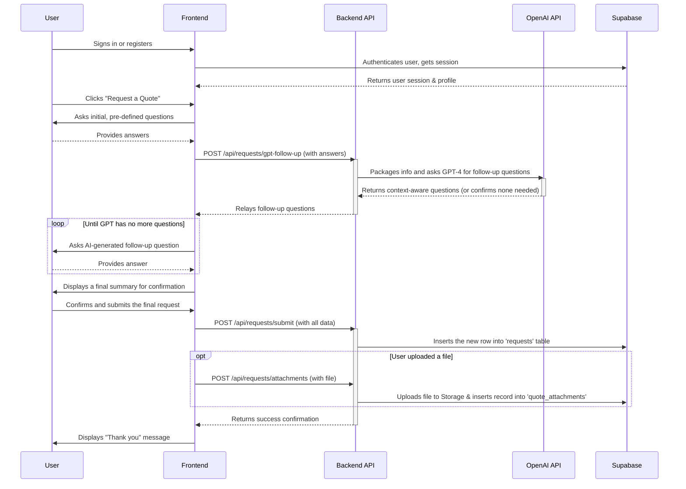
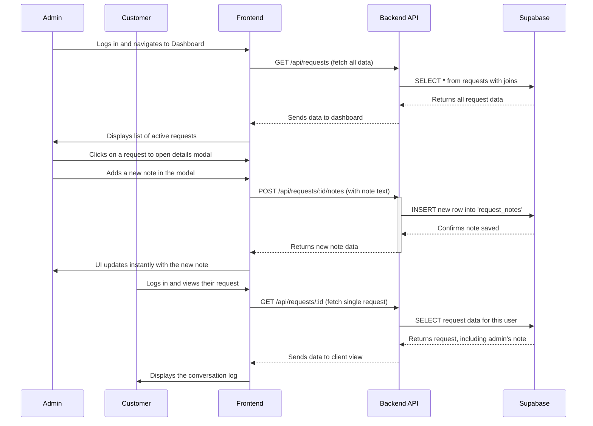
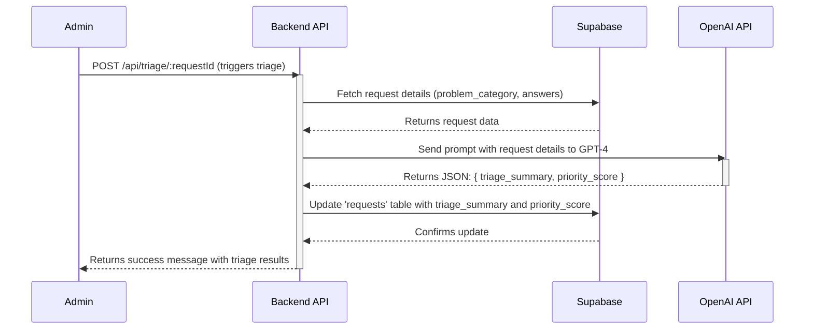
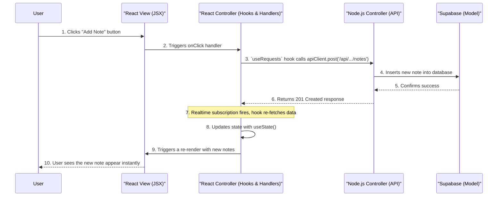
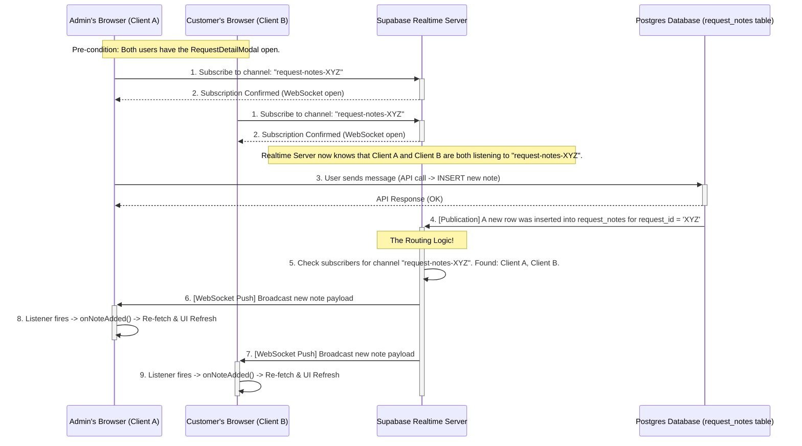

# PlumbingPOC: AI-Powered Client Management & Quoting Platform

**PlumbingPOC** is an end-to-end, fullstack client management and quoting platform built for local trades businesses. It transforms the initial point of contact from a simple form into an intelligent, AI-driven conversation, and extends into a full client portal for managing the entire job lifecycle.

Beyond intelligent lead qualification, it provides a secure command center for business owners to manage job statuses, create quotes, and communicate directly with clients. The platform features a responsive Vite + React frontend, a scalable MVC-patterned Node.js/Express backend, and deep integrations with OpenAI and Supabase for its core functionality.

## Features

-   **Modern Frontend:** A fully responsive web app built with Vite, React, and Tailwind CSS (TypeScript/TSX).
-   **Intelligent Quoting Agent:** A guided, conversational modal that uses expert logic and dynamic, AI-generated questions to ensure every lead is perfectly qualified.
-   **Scalable MVC Backend:** A robust Express/Node API architected for maintainability, featuring separate layers for routing, controllers, middleware, and validation.
-   **Secure Database & Auth:** Full integration with Supabase for user profiles, requests, quotes, notes, file storage, and secure authentication (Email/Password, Google, and Azure/Microsoft).
-   **Comprehensive Admin Dashboard:** A "Command Center" for business owners to view, manage, and act on all incoming quote requests in a professional, interactive UI.
-   **Interactive Job Management:** Update the status of any job (`new`, `quoted`, `scheduled`, `completed`) directly from the dashboard.
-   **Integrated Quoting & Communication:** Admins can create official quotes and both parties can add notes, creating a persistent, secure communication log for each job.

## Project Structure

The repository is organized for clarity and professional development standards.

```
.
├── PROMPTS/ # Prompt engineering & agent logic
├── vite-app/
│ ├── public/ # Static assets (images, etc.)
│ ├── src/ # Frontend React application (TSX)
│ ├── api/ # Backend API (Express/Node)
│ │ ├── controllers/ # Contains the core business logic for each route.
│ │ ├── middleware/ # Handles auth, validation, etc. before the controller.
│ │ ├── routes/ # Defines API endpoints and connects them to controllers.
│ │ ├── validation/ # Holds all Zod data validation schemas.
│ │ ├── README.md # Detailed API architecture documentation.
│ │ └── server.js # Initializes and wires up the Express server.
│ ├── SUPABASE_DATABASE_AND_AUTH_SETUP.md # Full setup guide for Supabase
│ └── ... # Vite config, etc.
├── blueprint.md # The original "Operation Overmatch" strategic plan
└── startup.sh # Convenience script for local development
```

---

---

## Local Development & Setup

### 1. Prerequisites

-   Node.js (v20 or higher recommended)
-   npm (or yarn/pnpm)
-   A Supabase account (free tier is sufficient)
-   An OpenAI API key

### 2. Initial Setup

1.  **Clone the repository:**
    ```sh
    git clone [your-repo-url]
    cd PlumbingPOC
    ```

2.  **Configure Supabase:**
    Follow the detailed instructions in `vite-app/SUPABASE_DATABASE_AND_AUTH_SETUP.md`. Run the **Master SQL Setup Script** to create all tables and apply the necessary Row Level Security (RLS) policies.

3.  **Set Up Environment Variables:**
    Navigate to the `vite-app/` directory, create a copy of `.env.example` named `.env`, and fill in your Supabase and OpenAI API keys.

        ### Netlify Deployment & Environment Variables
        - Netlify does **not** automatically use your local `.env` files for builds. You must manually add all required environment variables in the Netlify dashboard under "Site settings > Environment variables".
        - For frontend (Vite/React), all variables must be prefixed with `VITE_` (e.g., `VITE_SUPABASE_URL`, `VITE_SUPABASE_ANON_KEY`).
        - For backend (Node/Express), use non-prefixed variables (e.g., `SUPABASE_URL`, `SUPABASE_SERVICE_ROLE_KEY`, `OPENAI_API_KEY`).
        - **Supabase anon keys are not secrets**: The `VITE_SUPABASE_ANON_KEY` is designed to be public and is required for client-side Supabase usage. Netlify's secrets scanning may flag it, but you can safely ignore this warning. You do not need to treat it as a secret.
        - The Netlify config file (`netlify.toml`) is ignored for secrets scanning if you do not use the `[secrets]` section or related settings. Instead, manage all secrets and public variables in the Netlify dashboard.
        - If you see build failures due to secrets scanning, ensure your public keys (like `VITE_SUPABASE_ANON_KEY`) are not marked as secrets, or add them to the omit list if needed.

        ### Netlify Production Domain & Supabase Settings
        - Your production domain is: `https://plumbingpoc.netlify.app`
        - In your Supabase project settings, set:
            - **Site URL:** `https://plumbingpoc.netlify.app`
            - **Redirect URLs:** `https://plumbingpoc.netlify.app/*`
        - This ensures authentication and redirects work correctly in production. You can confirm the app is running and sign-in works at this domain.

4.  **Install Dependencies:**
    ```sh
    cd vite-app
    npm install
    ```

### 3. Running the Application

Both the backend API and the frontend server must be running simultaneously.

#### Recommended Method: Startup Script

From the project root directory, run the convenience script:
```sh
./startup.sh
```
This script will start both services in the background and provide you with the URLs. It will also give you a command to stop both services when you're done.

#### Manual Method

1.  **Start the Backend API Server:**
    In your first terminal, from the `vite-app/` directory:
    ```sh
    npm run start:api
    ```
    The API will start, typically on `http://your-local-backend-url/`.

2.  **Start the Frontend Vite Server:**
    In a second terminal, from the `vite-app/` directory:
    ```sh
    npm run dev
    ```
    The frontend will start, typically on `http://your-local-frontend-url/`.

3.  **Access the App:**
    Open your browser and navigate to `http://your-local-frontend-url/`.

---

## Application Flows
### 1. The AI-Powered Intake Flow
This diagram illustrates the initial, intelligent lead qualification process.
The intelligent agent is the core of this POC. Here's how it works:



### 2. The Client & Admin Management Flow

This diagram shows how admins and clients interact with a request after it has been submitted, turning the app into a client portal.



### 3. The AI-Powered Triage Process

After a new service request is submitted, the system automatically initiates an AI-powered triage process. This leverages OpenAI's powerful language models to analyze the request details, summarize the problem, and assign a priority score.


### 4. MVC architecture with react (Hook-Powered MVC Cycle)



### 5. Realtime publish/subscribe pattern between react and supabase

