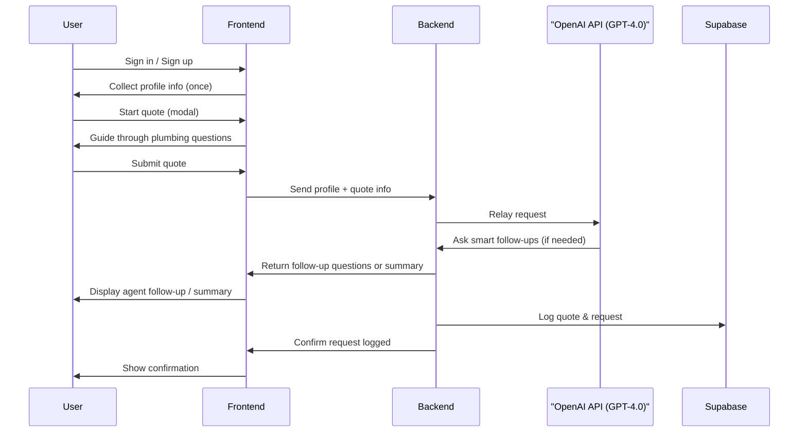
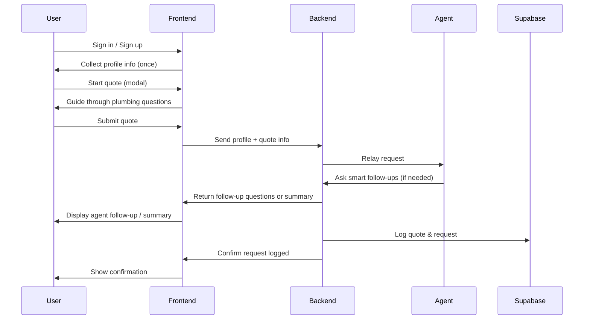

# Important: Running the Backend API Server

For the quoting flow and all `/api` routes to work, you must run the backend API server (Express/Node) separately from the frontend (Vite) server. The Vite frontend only serves static files and proxies API requests to the backend. If the backend is not running, you will see 404 errors for `/api/request` and similar routes.

### How to Run Both Servers

1. **Start the backend API server:**
   - Navigate to the backend directory (e.g., `api/` or wherever your `server.js` is located).
   - Run: `node server.js` or `npm run start:api` (depending on your setup).
   - Ensure it is listening on the port specified in your Vite proxy config (commonly `3001`).

2. **Start the frontend (Vite) server:**
   - In a separate terminal, run: `npm run dev` from the frontend directory (e.g., `vite-app/`).
   - The frontend will proxy `/api` requests to the backend if configured in `vite.config.js`.

3. **Access the app:**
   - Visit `http://localhost:5173` in your browser.
   - All API requests will be forwarded to the backend server.

#### Troubleshooting
- If you see `404 Not Found` errors for `/api/request`, make sure your backend server is running and the route exists.

## Quoting Flow Sequence Diagram



# PlumbingPOC: Fullstack AI-Powered Quoting & Lead Intake Platform


PlumbingPOC is a modern, fullstack proof-of-concept for a plumbing business. It features a responsive Vite + React (TypeScript/TSX) web app, modular backend API (Express/Node), and integrations with OpenAI and Supabase. The platform replaces traditional quote forms with an intelligent, guided intake agent that qualifies leads and captures all details needed for accurate quoting and efficient dispatch.

## Features
- Responsive web app (Vite + React + Tailwind CSS, TypeScript/TSX)
- Guided quoting agent with expert logic and dynamic question flow (modular, prompt-driven)
- Express/Node backend API for OpenAI GPT integration
- Supabase integration for storing quotes and user data
- Modular structure for easy iteration and future features (auth, quote history, reviews, etc.)

## Project Structure
- `vite-app/`
   - `src/` — Frontend React application (TypeScript/TSX)
   - `api/` — Backend API (Express/Node)
   - `plumbing_agent/` — Agent logic (for prototyping or future expansion)
- `.env` — API keys and environment variables
- `PROMPTS/` — Prompt engineering and agent logic docs
- `vite-app/SUPABASE_DATABASE_AND_AUTH_SETUP.md` — Supabase database schema, RLS, and authentication provider setup guide

### Example Directory Tree
```
vite-app/
├── src/
│   └── main.tsx
├── api/
│   └── server.js
│   └── main.py (if using Python agent)
├── plumbing_agent/
│   └── main.py
├── index.html
├── package.json
├── ...
```

## Supabase Table Schema
- `requests`: Stores quote/emergency intake requests
- `user_profiles`: Stores user profile info (linked to Supabase auth)
- `quotes`: Stores generated quotes for requests
- `invoices`: Stores invoices for completed jobs

## Authentication
- Email/password, Google, and Azure/Entra sign-in enabled via Supabase Auth
- Users can sign in using the button at the top right of the app
- After sign-in, a user menu appears (avatar or user icon)
   - Click to open menu with options: Settings, Sign Out
- Sign-out logic clears session and reloads the app

## UI Logic (Sign-In/Sign-Out)
- If not signed in, users see a sign-in page/modal (email, Google, Azure)
- After sign-in, user info and menu appear in the header
- Sign-out is available from the user menu, following the pattern in EXAMPLE_UI_REFERENCE

## Setup
   ```
## Quoting Flow Sequence Diagram


2. Configure Supabase tables, RLS policies, and authentication providers by following the instructions in `vite-app/SUPABASE_DATABASE_AND_AUTH_SETUP.md`.
3. Install dependencies:
   cd vite-app
   npm install
   ```
   ```
5. Start the backend API:
   ```sh
   npm run start:api
   ```

## How It Works
- Users click "Get a Plumbing Quote" in the web app
- Guided modal flow (powered by modular agent logic and prompt engineering) collects all required info
- Data is sent to the backend API, which calls OpenAI for recommendations
- Quotes are stored in Supabase for future reference

## Next Steps
- Integrate Supabase storage in both frontend and backend
- Add authentication, quote history, and more business features

## requesting a quote requirements

1. in order to request a quote, a user has to register and be signed in. the quote agent will take information from the user profile to complete a quote requestest.  need a profile in the system with contact info and be registered and signed in.
2. the agent will reduce chattiness with gpt4.0 as much as possible to reduce api consumption costs.  common questions based on the coding / design LLM of the agent service will economize by asking and anticipating common questions that will be built into the app.  "what would you like a quote for" give a list of all the common choices.  use list from #3 to generate that
3. Maintain a separate json file of 
service quote request types:  e.g. bathroom reno, perimiter drains, a list of all main types of plumbing requests as a list in json format. for each request type maintain a list of very common anticipated questions for each type of service quote request .  e.g. for a bathroom reno these types of questions would be there.  "What specific fixtures does the homeowner plan to use, or would they like options/recommendations?",
  "Are there any special requirements or features the homeowner is interested in, such as water-saving or smart fixtures?",
  "Is there an existing blueprint or design plan to follow for the renovation?",
  "Will any additional renovations be happening simultaneously that might affect the plumbing work?",
  "Are there any known issues with the existing plumbing that might complicate the renovation process?"
 but maintain similar common questions based on your expertise there. 
4. ask all these questions one at a time in conversation style like a chat conversation.  with text box at the bottom where user can hit send.  one question at a time. 
5. pull in the user profile information to add to the quote request.  don't ask for information you already know. 
6. don't share the personal information with GPT about name, phone, email, address ok.  only information to get context a follow-up questions for a better high quality quote request from gpt with all key questions answered.
8. package the quote for gpt with all the answers to the questions provided with what you know already.  format as an efficient prompt to gpt and all the answers provided. along with the high level quote request summary from the requestor
7. ask gpt if additional questions are required to have a all the key questions answered for the current context of the quote request 
8. take all the questions dyanmic ones from gpt and ask them . asking in the same way so transparent to the user.  they won't even know talking to gpt. 
like #4 above approach.  
9. if gpt has more questions repeat #7
10. package summary of request in user readable form. that includes their contact information.  give high level summary to the user of the quote request in user readable format.  then say submitting request for quote.  we will get back to you with a quote soon thank you very much. 

## Quick Start with Startup Script

A convenient `startup.sh` script is included to start both the backend and frontend services in the correct sequence, ensuring required ports are free. This helps avoid port conflicts and streamlines local development.

To use:

```sh
./startup.sh
```

- The script checks that backend (default: 3001) and frontend (default: 5173) ports are available before starting.
- If either port is in use, you'll see an error and the script will exit.
- Both services will start in the background, and you'll see URLs for each.
- To stop both services, use the provided `kill` command shown after startup.

---
For questions or contributions, open an issue or pull request!
