# PlumbingPOC: AI-Powered Client Management & Quoting Platform

**PlumbingPOC** is an end-to-end, fullstack client management and quoting platform built for local trades businesses. It transforms the initial point of contact from a simple form into an intelligent, AI-driven conversation powered by **OpenAI's Agent Toolkit**, and extends into a full client portal for managing the entire job lifecycle.

Beyond intelligent lead qualification, it provides a secure command center for business owners to manage job statuses, create quotes, and communicate directly with clients in real-time. The platform features a responsive Vite + React frontend, a scalable MVC-patterned Node.js/Express backend, and deep integrations with OpenAI's Agents API and Supabase for its core functionality.

## Features

-   **Modern Frontend:** A fully responsive web app built with Vite, React (TypeScript/TSX), Material-UI, and custom styled components, architected with a professional, feature-based structure.
-   **YAML-Driven AI Agents:** Configurable, intelligent agents defined in YAML files for quote intake and request triage, powered by OpenAI's function calling and structured outputs.
-   **Intelligent Quote Agent:** A guided, conversational modal that dynamically generates contextual questions based on customer responses, ensuring perfect lead qualification with minimal friction.
-   **AI-Powered Triage Agent:** Analyzes all customer Q&A data, problem descriptions, and service details to provide priority scores, profitability assessments, and business intelligence for incoming requests.
-   **Scalable MVC Backend:** A robust Express/Node API architected for maintainability, featuring separate layers for routing, controllers, middleware, and validation.
-   **Serverless Agent Functions:** Netlify Functions for quote-agent and triage-agent provide scalable, stateless execution of AI workflows.
-   **Secure Database & Auth:** Full integration with Supabase for user profiles, requests, quotes, notes, file storage, and secure authentication (Email/Password, Google, and Azure/Microsoft).
-   **Comprehensive Admin Dashboard:** A "Command Center" for business owners to view, manage, and act on all incoming quote requests in a professional, interactive UI.
-   **Interactive Job Management:** Update the status of any job (`new`, `quoted`, `scheduled`, `completed`) directly from the dashboard.
-   **Real-time Communication Log:** A live chat interface allowing admins and customers to communicate directly within a job's context, with messages appearing instantly for both parties.
-   **Contextual UX Design:** Chat interfaces with contextual icons (emergency alerts, property, calendar, etc.) and smooth interactive button states for enhanced user experience.

## Project Structure

The repository follows a modern monorepo architecture with separate packages for frontend and backend services, organized for clarity and professional development standards.

```
.
├── agents/               # YAML-driven AI agent definitions
│   ├── quote-agent.yaml  # Conversational quote intake workflow
│   └── triage-agent.yaml # Intelligent request analysis workflow
├── packages/
│   ├── frontend/         # React/Vite application
│   │   ├── src/          # React components and logic (TSX)
│   │   │   ├── features/ # Feature-based architecture
│   │   │   │   ├── auth/
│   │   │   │   ├── profile/
│   │   │   │   └── requests/ # Components, hooks, and types co-located
│   │   │   │       ├── components/
│   │   │   │       │   ├── QuoteAgentModal-ChatKit.tsx # Agent-driven UI
│   │   │   │       │   ├── RequestDetailModal.tsx      # Admin job management
│   │   │   │       │   └── AITriageSummary.tsx         # Triage display
│   │   │   └── lib/      # Shared libraries (Supabase client, API client)
│   │   ├── public/       # Static assets (images, etc.)
│   │   ├── index.html    # Main HTML template
│   │   ├── vite.config.js
│   │   └── package.json  # Frontend dependencies
│   └── backend/          # Node.js/Express API
│       ├── api/          # Express server and routes
│       │   ├── agents/   # AI agent runners
│       │   │   ├── quoteAgentRunner.js  # Quote agent logic
│       │   │   └── triageAgentRunner.js # Triage agent logic
│       │   ├── controllers/
│       │   ├── middleware/
│       │   ├── routes/
│       │   ├── services/
│       │   └── server.js
│       ├── netlify/
│       │   └── functions/ # Serverless agent functions
│       │       ├── api.mjs           # Main API wrapper
│       │       ├── quote-agent.mjs   # Quote agent endpoint
│       │       ├── triage-agent.mjs  # Triage agent endpoint
│       │       └── send-sms.mjs      # SMS notifications
│       └── package.json  # Backend dependencies
├── PROMPTS/              # Prompt engineering & agent logic documentation
├── supabase/
│   └── SUPABASE_DATABASE_AND_AUTH_SETUP.md # Full setup guide
├── docs/
│   └── NETLIFY_DEPLOYMENT.md         # Deployment guide
│   └── NETLIFY_TROUBLESHOOTING.md    # Common deployment issues
├── netlify.toml          # Netlify configuration with function settings
├── package.json          # Root workspace configuration
└── ...
```

---

## Local Development & Setup

### 1. Prerequisites

-   Node.js (v20 or higher recommended)
-   npm (or yarn/pnpm)
-   A Supabase account (free tier is sufficient)
-   An OpenAI API key

### 2. Initial Setup

1.  **Clone the repository:**
    ```sh
    git clone [your-repo-url]
    cd PlumbingPOC
    ```

2.  **Configure Supabase:**
    Follow the detailed instructions in `supabase/SUPABASE_DATABASE_AND_AUTH_SETUP.md`. This guide contains the master SQL script to create all tables, set up the real-time publications, and apply the necessary Row Level Security (RLS) policies.

3.  **Set Up Environment Variables:**
    From the project root, create a copy of `.env.example` named `.env`, and fill in your Supabase and OpenAI API keys.

4.  **Install Dependencies:**
    ```sh
    npm install
    ```
    This will install dependencies for all packages in the workspace.

### 3. Running the Application

Both the backend API and the frontend server must be running simultaneously.

#### Recommended Method: Startup Script

From the project root directory, run the convenience script:
```sh
./startup.sh
```
This script will start both services in the background and provide you with the URLs.

#### Manual Method

1.  **Start the Backend API Server:**
    From the project root directory:
    ```sh
    npm run dev:backend
    ```

2.  **Start the Frontend Vite Server:**
    In a second terminal, from the project root directory:
    ```sh
    npm run dev:frontend
    ```

3.  **Access the App:**
    Open your browser and navigate to the frontend URL provided by Vite (usually http://localhost:5173).

---

## AI Agent Architecture

PlumbingPOC leverages **YAML-driven AI agents** powered by OpenAI's function calling and structured outputs to create intelligent, conversational workflows.

### Agent Design Pattern

Each agent follows a consistent pattern:

1. **YAML Configuration** (`agents/*.yaml`) - Defines the workflow nodes, prompts, tools, and guardrails
2. **Agent Runner** (`packages/backend/api/agents/*Runner.js`) - Implements the business logic and OpenAI integration
3. **Netlify Function** (`packages/backend/netlify/functions/*.mjs`) - Provides serverless execution endpoint
4. **Frontend Integration** - React components consume the agent via API calls

### Quote Agent (`quote-agent.yaml`)

**Purpose:** Conversational quote intake with dynamic question generation

**Key Features:**
- Multi-node workflow (emergency_check → service_selection → dynamic_questions → review_summary)
- Context-aware question generation based on service type and previous answers
- Structured output validation ensuring complete data collection
- Session management for stateful conversations
- Automatic summary generation for customer review

**Technologies:**
- OpenAI GPT-4o with function calling
- YAML-based workflow definition
- Serverless execution via Netlify Functions
- Real-time UI updates with contextual icons (🚨 emergency, 🏠 property, 📅 calendar)

### Triage Agent (`triage-agent.yaml`)

**Purpose:** Intelligent analysis of quote requests for business prioritization

**Key Features:**
- Analyzes complete Q&A summaries from customer intake
- Calculates job complexity based on service type and location
- Assesses urgency using emergency status, timeline, and problem severity
- Provides priority scores (1-10) with detailed explanations
- Evaluates profitability potential considering job complexity and upsell opportunities

**Business Intelligence Tools:**
- `calculateJobComplexity()` - Service category and location-based scoring
- `assessCustomerUrgency()` - Timeline and severity analysis
- Structured JSON output with explanations for each score

**Output:**
```json
{
  "triage_summary": "2-3 sentence summary",
  "priority_score": 8,
  "priority_explanation": "Why this priority",
  "profitability_score": 7,
  "profitability_explanation": "Why this profitability",
  "complexity_score": 6,
  "urgency_score": 9
}
```

### Benefits of YAML-Driven Agents

✅ **Maintainability** - Workflow changes don't require code modifications  
✅ **Testability** - Agents can be tested independently with mock data  
✅ **Scalability** - New agents can be added following the same pattern  
✅ **Transparency** - Business logic is visible in human-readable YAML  
✅ **Version Control** - Workflow changes are tracked in git  

---

## Application Flows

### 1. The AI-Powered Intake Flow (YAML-Driven Agent)
This diagram illustrates the intelligent, agent-driven lead qualification process using the OpenAI Agent Toolkit.

```mermaid
sequenceDiagram
    participant User
    participant Frontend (ChatKit UI)
    participant Quote Agent Runner
    participant OpenAI API (GPT-4o)
    participant Supabase

    User->>Frontend (ChatKit UI): Signs in or registers
    Frontend (ChatKit UI)->>Supabase: Authenticates user, gets session
    Supabase-->>Frontend (ChatKit UI): Returns user session & profile

    User->>Frontend (ChatKit UI): Clicks "Request a Quote"
    
    Note over Frontend (ChatKit UI),Quote Agent Runner: Agent initialization with YAML config
    Frontend (ChatKit UI)->>Quote Agent Runner: POST /quote-agent (initialize session)
    activate Quote Agent Runner
    Quote Agent Runner->>Quote Agent Runner: Load quote-agent.yaml workflow definition
    Quote Agent Runner->>OpenAI API (GPT-4o): Request initial question based on service type
    OpenAI API (GPT-4o)-->>Quote Agent Runner: Returns structured question with options
    Quote Agent Runner-->>Frontend (ChatKit UI): First question (emergency check)
    deactivate Quote Agent Runner
    
    Frontend (ChatKit UI)->>User: Displays question with interactive pill buttons
    User-->>Frontend (ChatKit UI): Clicks response button
    
    loop Dynamic Conversation Flow (controlled by YAML nodes)
        Frontend (ChatKit UI)->>Quote Agent Runner: POST /quote-agent (with conversation history)
        activate Quote Agent Runner
        Quote Agent Runner->>Quote Agent Runner: Navigate YAML workflow nodes
        Quote Agent Runner->>OpenAI API (GPT-4o): Analyze responses & determine next question
        activate OpenAI API (GPT-4o)
        OpenAI API (GPT-4o)-->>Quote Agent Runner: Returns next question or completion signal
        deactivate OpenAI API (GPT-4o)
        Quote Agent Runner-->>Frontend (ChatKit UI): Next question with contextual icon
        deactivate Quote Agent Runner
        
        Frontend (ChatKit UI)->>User: Displays question with contextual UI (🚨/🏠/📅)
        User-->>Frontend (ChatKit UI): Provides answer
    end
    
    Note over Quote Agent Runner: Agent reaches review_summary stage
    Quote Agent Runner->>Frontend (ChatKit UI): Returns summary payload with all answers
    Frontend (ChatKit UI)->>User: Displays comprehensive review summary

    User->>Frontend (ChatKit UI): Confirms and submits the final request
    Frontend (ChatKit UI)->>Supabase: POST /api/requests/submit (with structured data)
    activate Supabase
    Supabase->>Supabase: Inserts request with answers array, service address, geocoding
    
    opt User uploaded attachments
        Frontend (ChatKit UI)->>Supabase: Upload files to Storage bucket
        Supabase->>Supabase: Insert records into 'quote_attachments'
    end

    Supabase-->>Frontend (ChatKit UI): Returns success with request ID
    deactivate Supabase
    Frontend (ChatKit UI)->>User: Displays "Thank you" confirmation
```



### 2. The Client & Admin Management Flow

This diagram shows how admins and clients interact with a request after it has been submitted.


### 3. The AI-Powered Triage Process (YAML-Driven Agent)

This shows the intelligent backend process for automatically analyzing a new request using the Triage Agent.


### 4. Real-time Publish/Subscribe Synchronization

This diagram illustrates how a message sent by one user appears instantly for another, using the Pub/Sub pattern.

```mermaid
sequenceDiagram
    participant Admin's Browser (Client A)
    participant Customer's Browser (Client B)
    participant Supabase Realtime Server
    participant Postgres Database

    Note over Admin's Browser (Client A), Customer's Browser (Client B): Pre-condition: Both users are viewing the same Job Docket.
    Note over Admin's Browser (Client A), Customer's Browser (Client B): The `useRequests` hook has already subscribed both clients to the channel.

    Admin's Browser (Client A)->>+Postgres Database: 1. User sends message (API call -> INSERT new note)
    Postgres Database-->>-Admin's Browser (Client A): API Response (OK)

    Postgres Database->>+Supabase Realtime Server: 2. [Publication] A change was detected in the `request_notes` table.
    
    Note over Supabase Realtime Server: Routing Logic!
    Supabase Realtime Server->>Supabase Realtime Server: 3. Check subscribers for the relevant channel. Found: Client A, Client B.

    Supabase Realtime Server->>+Admin's Browser (Client A): 4. [WebSocket Push] Broadcast new data payload
    Admin's Browser (Client A)->>Admin's Browser (Client A): 5. `useRequests` hook re-fetches data & UI refreshes
    deactivate Admin's Browser (Client A)

    Supabase Realtime Server->>+Customer's Browser (Client B): 4. [WebSocket Push] Broadcast new data payload
    Customer's Browser (Client B)->>Customer's Browser (Client B): 5. `useRequests` hook re-fetches data & UI refreshes
    deactivate Customer's Browser (Client B)
    
    deactivate Supabase Realtime Server
```# Test commit to trigger Netlify deployment
# Force deployment trigger - Thu Oct  9 07:47:11 PDT 2025
