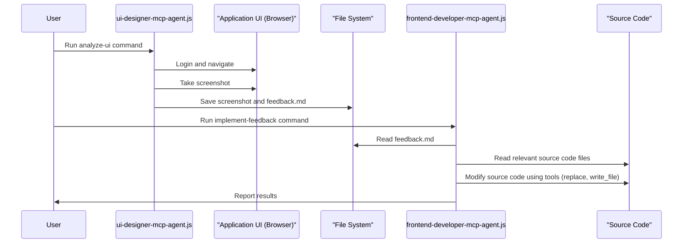
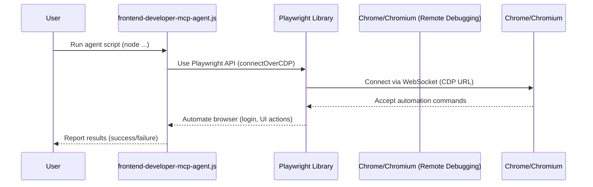

# Preconditions

Before running any agent workflows, ensure:
- The Playwright MCP server is installed globally as described in `AGENT_REPOS.md`.
- The Playwright MCP server is running in a separate terminal via:
   ```
   playwright-mcp-server
   ```

# How to Use These Agents Most Effectively

**Best Practices:**
- Start a new chat or session for each agent to keep context focused and results actionable.
- Use the provided prompts for each agent to initiate work and get targeted feedback.
- Begin with the project manager agent to organize tasks and track progress.
- Use specialized agents (UI designer, frontend developer, backend architect) for their respective tasks.
- Regularly update and review progress with the project manager agent to keep all agents aligned.
- **For all browser-based automation, UI testing, and agent workflows, use the Playwright MCP server.**

# Instructions to test Playright MCP server

To verify your Playwright MCP server is operational, use the provided test script:

1. Ensure the Playwright MCP server is running (see `AGENT_REPOS.md` for installation and setup instructions).
2. Make sure the Plumbing Quote Agent dashboard is running at http://your-local-frontend-url/.
3. Run the test script from this directory:
   ```bash
   node agents/test-playwright-mcp.js
   ```
4. The script will:
   - Connect to the Playwright MCP server at ws://your-local-playwright-server/
   - Register a new user, sign out, and sign in at http://your-local-frontend-url/
   - Log each step and save results to `test-results.json`
5. Check `test-results.json` for pass/fail status and details of each step.

If you need to adjust selectors or debug errors, review the script and update field/button selectors to match your app's HTML.


# Agents Folder Overview

This folder contains specialized MCP agent personas to support your AI-driven development workflow. Each agent is designed to automate, evaluate, and accelerate different aspects of your project.


## Sub-Agents Summary


### 1. `project-manager-mcp`
**Role:** Project manager and task tracker
**Purpose:** Tracks requirements, assigns tasks, monitors progress, and keeps all agents aligned
**How to initiate:**
**Step 1: Start here.**

#### Assumptions: 
1. The Playwright MCP server is running. I've started it via `npx playwright run-server` It is listening on ws://your-local-playwright-server/
2. The Plumbing Quote Agent dashboard is running at http://your-local-frontend-url/ 

#### Prompt:

#### Copy-paste Prompt for Next Time:
```
As the project-manager-mcp agent, connect to the running Playwright MCP server at Listening on ws://your-local-playwright-server/
 for browser automation, UI testing, and agent orchestration. Target the Plumbing Quote Agent dashboard at http://your-local-frontend-url/.

Review all current work and requirements for the Plumbing Quote Agent. Update TASKS.md to show completed tasks, outstanding work, and agent assignments. Summarize progress and recommend next steps. Ensure all anticipated questions for each service type are surfaced in the UI, and confirm privacy requirements are enforced. Reference key instructions from TASKS.md.
```

#### To create the project-manager-mcp agent, follow these steps:


This prompt can be used directly in your agent client or workflow to launch the project-manager-mcp agent and ensure all required actions are performed.

### 2. `ui-designer-mcp`
**Role:** Visionary UI designer
**Purpose:** Evaluates UI/UX, suggests improvements, and provides implementation-ready feedback
**How to initiate:**
**Step 2: Run after project manager agent.**

#### Assumptions:
1. The Playwright MCP server should be running. (e.g., ws://your-local-playwright-server/)
2. The Plumbing Quote Agent dashboard is running at http://your-local-frontend-url/

#### Copy-paste Prompt for Next Time:
```
As the ui-designer-mcp agent, connect to the running Playwright MCP server at ws://your-local-playwright-server/ for browser-based UI/UX analysis. Target the Plumbing Quote Agent dashboard at http://your-local-frontend-url/.

Perform a comprehensive UI/UX analysis. Evaluate design consistency, usability, accessibility, and performance. Suggest prioritized improvements and generate a markdown report with findings, scores, and screenshots. Reference TASKS.md for requirements.
```

This prompt can be used directly in your agent client or workflow to launch the ui-designer-mcp agent and ensure all required actions are performed.


### 3. `frontend-developer-mcp`
**Role:** Elite frontend developer
**Purpose:** Implements UI/UX improvements, optimizes performance, and ensures accessibility
**How to initiate:**
**Step 3: Run after UI designer agent.**

#### Assumptions:
1. The Playwright MCP server should be running. (e.g., ws://your-local-playwright-server/)
2. The Plumbing Quote Agent dashboard is running at http://your-local-frontend-url/

#### Copy-paste Prompt for Next Time:
```
As the frontend-developer-mcp agent, connect to the running Playwright MCP server at ws://your-local-playwright-server/ for browser-based automation, testing, and UI validation. Target the Plumbing Quote Agent dashboard at http://your-local-frontend-url/.

Implement the UI/UX improvements suggested by the ui-designer-mcp agent. Optimize the frontend for performance, accessibility, and responsiveness. Ensure all anticipated service questions are surfaced in the UI. Provide a summary of changes, code snippets, and recommendations for further improvement. Update TASKS.md as items are completed.
```

This prompt can be used directly in your agent client or workflow to launch the frontend-developer-mcp agent and ensure all required actions are performed.
## Playwright MCP Server Setup & Usage

All browser-based agent prompts and automation should use the Playwright MCP server for reliability and standardization.

**Install globally (recommended):**
```
sudo npm install -g @executeautomation/playwright-mcp-server
```

**Run the server:**
```
playwright-mcp-server
```

**Verify:**
- You should see output in your terminal indicating the server has started, including port and endpoint details.

**Use in agent prompts:**
- Reference Playwright MCP server in your agent CLI commands and prompts for all browser automation, UI testing, and web scraping tasks.

### 4. `backend-architect-mcp`
**Role:** Backend architect
**Purpose:** Designs and reviews backend architecture, APIs, and database models
**How to initiate:**
**Step 4: Run after frontend developer agent.**

#### Assumptions:
1. The Playwright MCP server should be running. (e.g., ws://your-local-playwright-server/) if browser automation is required.
2. The Plumbing Quote Agent dashboard is running at http://your-local-frontend-url/ (if needed).

#### Copy-paste Prompt for Next Time:
```
As the backend-architect-mcp agent, review the current backend architecture, APIs, and database models. Suggest and implement improvements for scalability, security, and maintainability. Confirm privacy logic for GPT interaction is enforced and documented. Provide actionable recommendations and update TASKS.md with completed and outstanding backend tasks.
```

This prompt can be used directly in your agent client or workflow to launch the backend-architect-mcp agent and ensure all required actions are performed.

---

## Recommendations: What to Do Next

## Step-by-Step Agent Workflow

1. **Start with the Project Manager Agent:**
   - Run the project-manager-mcp agent first to review work, update TASKS.md, and assign tasks.

2. **UI Evaluation:**
   - Run the ui-designer-mcp agent to analyze the UI and suggest improvements.

3. **Frontend Implementation:**
   - Run the frontend-developer-mcp agent to implement UI/UX improvements and optimize the frontend.

4. **Backend Review:**
   - Run the backend-architect-mcp agent to review and improve backend architecture, security, and privacy.

5. **Iterate and Track Progress:**
   - Regularly re-run the project-manager-mcp agent to update TASKS.md, monitor progress, and keep all agents aligned.

**Tip:** Always follow this order for maximum efficiency. Use the exact prompts and CLI commands above for each agent.

## UI Designer and Frontend Developer Workflow

This workflow demonstrates how the UI Designer and Frontend Developer agents can collaborate to improve the application's UI.

**Step 1: Run the UI Designer Agent**

The UI Designer agent logs in to the application, analyzes the UI, and captures a screenshot for review.

```bash
node agents/ui-designer-mcp-agent.js analyze-ui <email> <password>
```

This will save a screenshot named `dashboard-analysis.png` in the `agents/screenshots` directory. In a real-world scenario, the agent would also generate a markdown file with detailed feedback.

**Step 2: Handoff to the Frontend Developer Agent**

The output of the UI Designer agent (the screenshot and a feedback file) serves as the input for the Frontend Developer agent. This file-based handoff is how the agents communicate.

**Step 3: Run the Frontend Developer Agent**

The Frontend Developer agent reads the feedback from the UI Designer agent and implements the suggested changes in the code.

*(Note: The following command is a conceptual example. The `frontend-developer-mcp-agent.js` would need to be extended to read a feedback file and modify the code.)*

```bash
node agents/frontend-developer-mcp-agent.js implement-feedback --feedback-file agents/feedback/ui-feedback.md
```

**Step 4: Code Updates**

The Frontend Developer agent uses its tools (`read_file`, `replace`, `write_file`) to modify the application's source code (e.g., the React components in `vite-app/src/components`).

### Agent Collaboration Diagram



## MCP Agent Automation Flow



### Explanation
- **Playwright Library**: Node.js package used by your agent script for browser automation.
- **Chrome/Chromium (Remote Debugging)**: Browser started in remote-debugging mode, exposes a WebSocket endpoint.
- **frontend-developer-mcp-agent.js**: Agent script that uses Playwright to automate browser tasks.
- **User**: Runs the agent and receives results.

You do not need to run a Playwright server for MCP agent automation. The agent script uses Playwright to connect directly to the browser.
