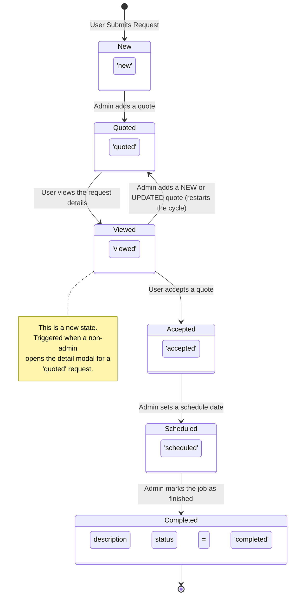

# State changes for workflow of quote requests

```mermaid
stateDiagram-v2
    direction TB

    [*] --> New: User Submits Request

    state New {
        description status = 'new'
    }
    state Quoted {
        description status = 'quoted'
    }
    state Viewed {
        description status = 'viewed'
    }
    state Accepted {
        description status = 'accepted'
    }
    state Scheduled {
        description status = 'scheduled'
    }
    state Completed {
        description status = 'completed'
    }

    New --> Quoted: Admin adds a quote
    Quoted --> Viewed: User views the request details
    Viewed --> Accepted: User accepts a quote
    Viewed --> Quoted: Admin adds a NEW or UPDATED quote (restarts the cycle)
    Accepted --> Scheduled: Admin sets a schedule date
    Scheduled --> Completed: Admin marks the job as finished

    Completed --> [*]

    note right of Viewed
        This is a new state.
        Triggered when a non-admin
        opens the detail modal for a
        'quoted' request.
    end note
```
