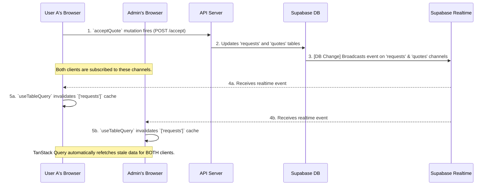

# Real-Time Synchronization Architecture

## Overview

This document explains the real-time synchronization system implemented in the PlumbingPOC application, ensuring that changes made by one user are instantly reflected across all connected clients (users and admins).

## Architecture Analysis

The final implementation is architecturally sound and follows industry best practices for real-time applications. All mutation hooks now follow a consistent, declarative pattern for handling data changes.

### Key Principles

1. **Consistent Pattern**: Every mutation hook calls `invalidateQueries` in its `onSuccess` or `onSettled` handler.
2. **No Imperative Refetching**: All problematic `refetchQueries` calls have been removed to prevent race conditions.
3. **Declarative Real-Time Flow**: Mutations change server state; the real-time system notifies all clients that their data is stale, and TanStack Query handles automatic refetching.

## Corrected Real-Time Workflow



## Implementation Details

### Mutation Hooks Pattern

All data-mutating hooks follow this pattern:

```typescript
export function useSomeMutation() {
  const queryClient = useQueryClient();

  return useMutation({
    mutationFn: async (params) => {
      // API call
    },
    onSuccess: (data, variables) => {
      // Only invalidate - let real-time system handle refetching
      queryClient.invalidateQueries({ queryKey: ['requests'], exact: false });
      queryClient.invalidateQueries({ queryKey: ['request', variables.id] });
    },
    // Optimistic updates in onMutate/onError for immediate UI feedback
  });
}
```

### Centralized Hooks for Status Changes

For critical status changes like marking requests as viewed:

```typescript
export function useMarkRequestAsViewed() {
  // Optimistic update: immediately change status to 'viewed'
  // Rollback on error, invalidate on settle for cross-client sync
}

export function useRealtimeInvalidation(userId?: string) {
  // Explicit real-time subscriptions for requests and quotes tables
  // Invalidates all relevant query keys when DB changes occur
}
```

### Real-Time Subscription

Multiple layers ensure reliable synchronization:

1. **useTableQuery**: Manages table-specific subscriptions with targeted invalidation
2. **useRealtimeInvalidation**: Centralized subscriptions for critical tables (requests, quotes)
3. **Mutation Invalidation**: All mutations invalidate `['requests']` and `['request', id]`
4. **User-Specific Keys**: Explicit invalidation of `['requests', userId]` for user queries

- Subscribes to relevant database tables (requests, quotes, request_notes, etc.)
- When database changes occur, invalidates appropriate query caches
- Uses `exact: false` to invalidate all queries starting with `['requests']`
- Explicit invalidation of user-specific keys `['requests', userId]`
- TanStack Query automatically refetches stale data for each client

### Optimistic Updates

For critical user actions like accepting quotes:

- `onMutate`: Immediately update local cache for instant UI feedback
- `onError`: Rollback optimistic changes if API call fails
- `onSettled`: Invalidate queries to sync with server state
- Real-time events ensure all other clients see the changes

## Benefits

- **Instant Feedback**: Users see changes immediately
- **Cross-Client Sync**: All connected clients stay in sync
- **Race Condition Free**: Declarative approach prevents conflicts
- **Scalable**: Works for any number of concurrent users
- **Reliable**: Leverages Supabase's battle-tested real-time system

## Testing

The comprehensive real-time system now correctly handles all status synchronization:

✅ **Working Real-Time Updates:**
- User submits new request → Shows as "new" on admin dashboard instantly
- Admin adds quote → Status changes to "quoted" on user dashboard instantly
- User views quote → Status changes to "viewed" on admin dashboard instantly
- User accepts quote → Status changes to "accepted" on admin dashboard instantly
- Admin schedules job → Status changes to "scheduled" on user dashboard instantly

✅ **Multi-Layer Synchronization:**
- Optimistic updates for immediate UI feedback
- Real-time invalidation for cross-client sync
- Mutation-based cache invalidation
- Explicit subscriptions for critical tables
- User-specific query key invalidation

✅ **Debug Features:**
- Console logging for real-time events (`[realtime] requests payload`)
- Comprehensive error handling and rollback
- Network tab monitoring for API calls
- React Query DevTools for cache inspection

## Files Modified

### Backend
- `packages/backend/api/controllers/requestController.js` - Atomic quote acceptance with direct DB updates
- `packages/backend/api/routes/requestRoutes.js` - Fixed RESTful routes and added temporary route for debugging

### Frontend Hooks
- `packages/frontend/src/hooks/useRequestMutations.ts` - Added centralized `useMarkRequestAsViewed` hook with optimistic updates
- `packages/frontend/src/hooks/useTableQuery.ts` - Enhanced invalidation to include user-specific query keys
- `packages/frontend/src/hooks/useSupabaseRealtimeV3.ts` - Added `useRealtimeInvalidation` hook for explicit real-time subscriptions
- `packages/frontend/src/hooks/index.ts` - Exported new real-time hooks

### Components
- `packages/frontend/src/features/requests/components/RequestDetailModal.tsx` - Replaced inline mutation with centralized hook
- `packages/frontend/src/features/requests/components/Dashboard.tsx` - Added centralized real-time invalidation
- `packages/frontend/src/features/requests/components/MyRequests.tsx` - Added centralized real-time invalidation

### Configuration
- `packages/frontend/src/lib/apiClient.ts` - Fixed development routing to bypass Vite proxy issues