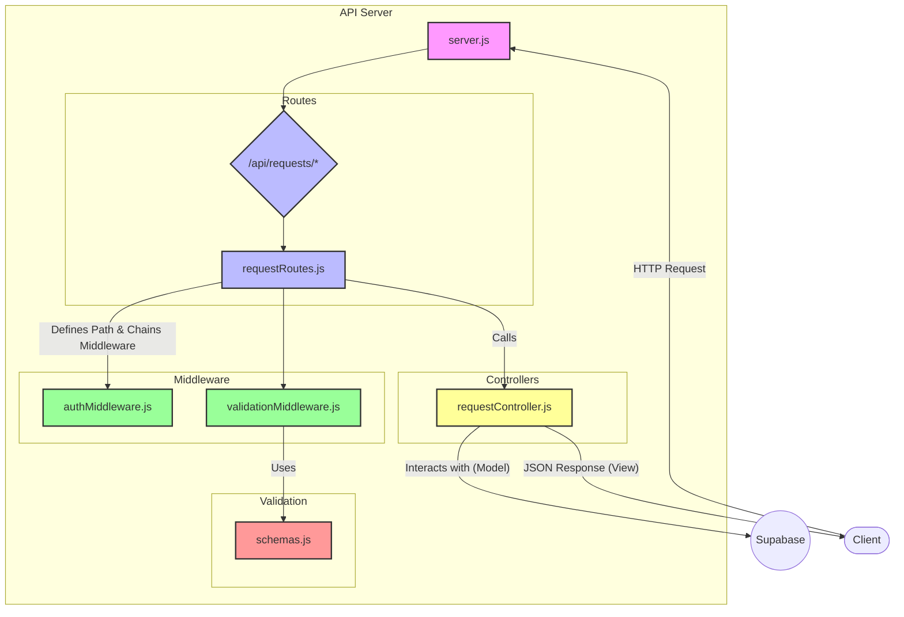
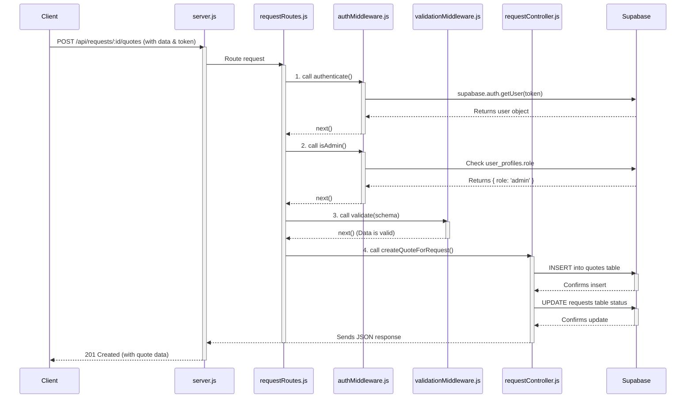
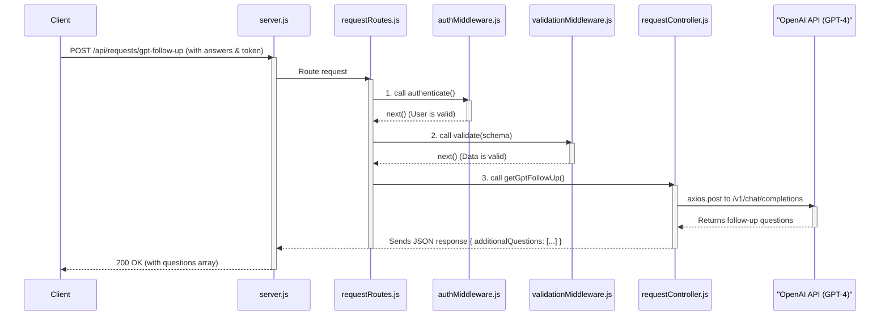

# PlumbingPOC API Server

This document outlines the architecture and conventions for the PlumbingPOC API server, built with Node.js and Express using an MVC-inspired pattern.

## Core Architecture: MVC Pattern

**Model:** Supabase handles all database interactions, data shaping, and enforces data integrity through its schema and Row Level Security (RLS) policies.

**View:** For a REST API, the "View" is the JSON data sent to the client. Controllers assemble and send these responses.

**Controller:** Contains the core business logic. Controllers receive requests from routes, interact with the Model (Supabase), and send a response back through the View (JSON).

---

## Directory Structure

```text
api/
├── controllers/           # Business logic (MVC: Controller)
│   └── requestController.js
├── middleware/            # Reusable functions before controllers
│   ├── authMiddleware.js
│   └── validationMiddleware.js
├── routes/                # Maps URLs to controllers
│   └── requestRoutes.js
├── validation/            # Data contracts (schemas)
│   └── schemas.js
└── server.js              # Main application entry point
```

## File Responsibilities

### `server.js`

- Initializes the Express app
- Configures core middleware (CORS, body-parser)
- Loads and delegates all API routes to the `routes/` directory
- Defines a global error handler
- Starts the server

### `/routes`

Defines endpoints (e.g., `/submit`, `/:requestId/notes`), specifies HTTP methods (GET, POST), and chains middleware before passing the request to the controller.

**Example from `requestRoutes.js`:**

```javascript
// Create a formal quote for a request (admin only)
router.post(
    '/:requestId/quotes', // The Path
    authenticate,         // Middleware 1: Is the user logged in?
    isAdmin,              // Middleware 2: Does the user have admin role?
    validate(createQuoteSchema), // Middleware 3: Is the request body valid?
    createQuoteForRequest // The Controller function to run
);
```

### `/controllers`

Self-contained business logic for specific tasks (e.g., submitting a quote, adding a note). Receives `req` and `res` after middleware.

### `/middleware`

Reusable functions between route and controller.
- `authMiddleware.js`: Handles authentication (`authenticate`) and role-based authorization (`isAdmin`).
- `validationMiddleware.js`: Generic `validate` function checks incoming request data against a schema.

### `/validation`

Defines "data contracts" using zod. Each schema in `schemas.js` clearly defines the expected shape and types for endpoint request bodies, params, or queries.

## Request Lifecycle

1. **Client Request:** React app sends a POST request to `/api/requests/:id/notes`.
2. **server.js:** Request hits `server.js`, passes through CORS and JSON body parser.
3. **routes/requestRoutes.js:** Router matches path/method, applies `authenticate` middleware and `addNote` controller.
4. **middleware/authMiddleware.js:** `authenticate` checks for valid JWT, attaches `req.user` and calls `next()`. If invalid, sends 401 Unauthorized and stops flow.
5. **controllers/requestController.js:** `addRequestNote` runs, interacts with Supabase, sends JSON response (e.g., `res.status(201).json(...)`).
6. **Client Receives Response:** React app receives JSON data or error message.

This clean separation makes the system robust and predictable.

## API Testing and Troubleshooting with cURL and JWT

When developing or debugging API endpoints that require authentication, `cURL` is an invaluable tool. Here's how to use it effectively with JWT tokens:

### 1. Getting Your JWT Token from the Browser

To interact with authenticated endpoints, you'll need a valid JWT token. You can obtain this from your browser's developer tools after a successful login:

1. Open your browser's developer tools (usually F12 or Cmd+Option+I).
2. Go to the 'Network' tab.
3. Perform an action in your application that triggers an authenticated API request (e.g., logging in, fetching user data).
4. Find the relevant API request in the Network tab.
5. In the request details, look for the 'Headers' section.
6. Locate the `Authorization` header. The value will typically be in the format `Bearer <YOUR_JWT_TOKEN>`. Copy the `<YOUR_JWT_TOKEN>` part.

### 2. Constructing and Executing the cURL Command

Once you have your token, you can construct a `cURL` command to test authenticated endpoints. Remember to replace placeholders with your actual data.

```bash
curl -X <HTTP_METHOD> \
     http://localhost:3000/api/<YOUR_ENDPOINT> \
     -H "Content-Type: application/json" \
     -H "Authorization: Bearer <YOUR_JWT_TOKEN>" \
     -d '{"key": "value"}' # Only for POST/PUT requests with a body
```

**Important:** When executing in your terminal, ensure the entire `cURL` command is on a **single line** to avoid shell parsing errors.

### 3. Troubleshooting JWT Tokens with jwt.io

If you encounter "Unauthorized: Invalid token" errors, your JWT might be expired or malformed. `jwt.io` is an excellent online tool for inspecting JWTs:

1. Go to [jwt.io](https://jwt.io/).
2. Paste your full JWT token into the 'Encoded' section on the left.
3. **Expected Result:** You will likely see a message like "a-string-secret-at-least-256-bits-long" in the "Signature Verified" section. This is normal and expected, as `jwt.io` does not have access to your Supabase project's secret key to verify the token's signature. The important part is to inspect the payload.
4. The 'Payload' section on the right will decode the token, showing its claims (data).
5. **Check the `exp` (expiration) claim:** This is a Unix timestamp. If the current time is past this timestamp, your token has expired, and you'll need to generate a new one.
6. **Inspect other claims:** Ensure that claims like `role` (e.g., `admin`) and `email` match your expectations for the user.

## Mermaid diagrams


### relationship diagram


### Sequence Diagram Admin Creates a Quote (The Original Diagram)

### Sequence diagram AI Generates Follow-up Questions
