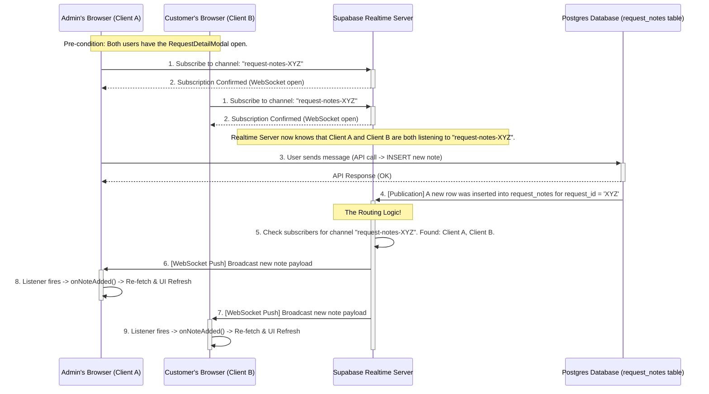

# Supabase Database and Auth Setup information

## Table of Contents

1.  [Supabase Database Configuration](#1-supabase-database-configuration)
    -   [Table Schema Overview](#1a-table-schema-overview)
    -   [Admin Role Check Function (`is_admin`)](#1b-admin-role-check-function-is_admin)
    -   [Storage Bucket: PlumbingPoCBucket](#1c-storage-bucket-plumbingpocbucket)
    -   [Row Level Security (RLS) Policies](#1d-row-level-security-rls-policies)
2.  [Database Schema Files](#2-database-schema-files)
    -   [Complete Schema Dump (`schema.sql`)](#2a-complete-schema-dump-schemasql)
    -   [Schema Generation Guide (`HowToGenerateSupabaseSchema.md`)](#2b-schema-generation-guide-howtogeneratesupabaseschemamd)
    -   [Legacy SQL Setup Scripts (Deprecated)](#2c-legacy-sql-setup-scripts-deprecated)
3.  [Master SQL Setup Script (For Manual Policy Updates)](#3-master-sql-setup-script-for-manual-policy-updates)
4.  [Authentication Provider Configuration](#4-authentication-provider-configuration)
5.  [Helpful CLI Commands & Queries](#5-helpful-cli-commands--queries)

---

## Supabase & Authentication Provider Setup Reference

This document provides a comprehensive reference for the project's Supabase database schema, security policies, and authentication provider setup.

### 1. Supabase Database Configuration

#### 1a. Table Schema Overview

The database is composed of several related tables to manage users, requests, quotes, and communications.

-   **user_profiles**
    -   Stores public-facing user data, linked one-to-one with `auth.users`.
    -   `id` (uuid, primary key, default: gen_random_uuid())
    -   `user_id` (uuid, **unique**, references `auth.users.id`)
    -   `name` (text)
    -   `email` (text)
    -   `phone` (text)
    -   `created_at` (timestamptz, default: now())
    -   `address` (text)
    -   `city` (text)
    -   `postal_code` (text)
    -   `province` (text)
    -   `role` (text, not nullable, default: 'user')

-   **requests**
    -   The core table for initial customer quote requests.
    -   `id` (uuid, primary key, default: gen_random_uuid())
    -   `created_at` (timestamptz, default: now())
    -   `is_emergency` (boolean)
    -   `customer_name` (text)
    -   `service_address` (text)
    -   `contact_info` (text)
    -   `problem_category` (text)
    -   `problem_description` (text)
    -   `property_type` (text)
    -   `is_homeowner` (boolean)
    -   `preferred_timing` (text)
    -   `additional_notes` (text)
    -   `answers` (jsonb)
    -   `status` (text)
    -   `user_id` (uuid, references `user_profiles.user_id`)
    -   `updated_at` (timestamptz)
    -   `scheduled_start_date` (timestamptz)
    -   `last_follow_up_sent_at` (timestamptz)
    -   `triage_summary` (text)
    -   `priority_score` (integer)

-   **quote_attachments**
    -   Stores records of files uploaded for a specific request.
    -   `id` (uuid, primary key, default: gen_random_uuid())
    -   `request_id` (uuid, references `requests.id`)
    -   `file_url` (text, not nullable)
    -   `file_name` (text)
    -   `mime_type` (text)
    -   `uploaded_at` (timestamptz, default: now())
    -   `quote_id` (uuid, references `quotes.id`)

-   **quotes**
    -   Stores formal quotes generated by an admin for a request.
    -   `id` (uuid, primary key, default: gen_random_uuid())
    -   `user_id` (uuid)
    -   `request_id` (uuid)
    -   `quote_amount` (numeric)
    -   `status` (text)
    -   `created_at` (timestamptz, default: now())
    -   `labor_items` (jsonb)
    -   `material_items` (jsonb)
    -   `notes` (text)
    -   `good_until` (date)
    -   `tax_details` (jsonb)
    -   `updated_at` (timestamptz, default: now())
    -   `details` (text)

-   **request_notes**
    -   A log of all communication between the customer and admin regarding a request.
    -   `id` (uuid, primary key, default: gen_random_uuid())
    -   `request_id` (uuid, not nullable, references `requests.id`)
    -   `user_id` (uuid, not nullable, references `auth.users.id`)
    -   `author_role` (text, not nullable)
    -   `note` (text, not nullable)
    -   `created_at` (timestamptz, default: now())

-   **invoices**
    -   Stores invoice data linked to an accepted quote.
    -   `id` (uuid, primary key, default: gen_random_uuid())
    -   `user_id` (uuid)
    -   `quote_id` (uuid, references `quotes.id`)
    -   `amount_due` (numeric)
    -   `due_date` (timestamptz)
    -   `status` (text)
    -   `created_at` (timestamptz, default: now())

#### 1b. Admin Role Check Function (`is_admin`)

To reliably check for administrative privileges within Row Level Security policies without causing infinite recursion, we use a `SECURITY DEFINER` function. This is the standard, most robust method.

-   **Function:** `public.is_admin()`
    -   Returns `true` if the currently authenticated user has the role of 'admin' in their `user_profiles` record, and `false` otherwise.
    -   `SECURITY DEFINER` allows it to query `user_profiles` safely from within an RLS policy on that same table, breaking the recursion loop. All RLS policies that require admin checks now call this function.

#### 1c. Storage Bucket: PlumbingPoCBucket

-   **Purpose:** Securely stores all user-uploaded files (images, PDFs) related to quote requests.
-   **Access:** This bucket is **NOT** public. All access is controlled by Storage Policies.
-   **Policies (SQL):**
    ```sql
    -- Allows any logged-in user to UPLOAD a file.
    CREATE POLICY "Allow authenticated uploads"
    ON storage.objects FOR INSERT
    TO authenticated
    WITH CHECK ( bucket_id = 'PlumbingPoCBucket' );

    -- Allows an ADMIN to view/download ANY file.
    -- This now uses our robust is_admin() function.
    CREATE POLICY "Allow admin read access"
    ON storage.objects FOR SELECT
    TO authenticated
    USING ( is_admin() );
    ```

#### 1d. Row Level Security (RLS) Policies

RLS is **ENABLED** on all public tables. The security model is straightforward:
-   **Regular users** can perform actions (create, read, update, delete) only on records they own (where `auth.uid() = user_id`).
-   **Admins** (as determined by the `is_admin()` function) have unrestricted access to all records in all tables.

### 2. Database Schema Files

#### 2a. Complete Schema Dump (`schema.sql`)

The `supabase/schema.sql` file is the authoritative, complete database schema generated using the Supabase CLI (`supabase db dump`). This file contains:

- All table definitions with columns, constraints, and indexes
- All functions, triggers, and policies
- All extensions and publications
- The complete, current state of the database structure

**To recreate the database from scratch:**
```bash
supabase db dump -f supabase/schema.sql
# Then restore with:
psql -h your-db-host -U your-username -d your-database < supabase/schema.sql
```

**Important:** This file replaces all individual SQL setup files and should be used as the single source of truth for the database schema.

#### 2b. Schema Generation Guide (`HowToGenerateSupabaseSchema.md`)

The `supabase/HowToGenerateSupabaseSchema.md` file contains step-by-step instructions for generating the `schema.sql` file using the Supabase CLI. This ensures you always have an up-to-date, version-controlled copy of your database structure.

### 3. Legacy SQL Setup Scripts (Deprecated)

**Note:** The following SQL files are now deprecated and redundant since the complete schema is available in `schema.sql`. They are kept for historical reference only.

- `SUPABASE_QUOTE_ATTACHMENTS_TABLE.sql` - Table creation for quote_attachments (now in schema.sql)
- `SUPABASE_TABLES.sql` - Policy fixes and column additions (now in schema.sql)

### 4. Master SQL Setup Script (For Manual Policy Updates)

This single, idempotent script can be run in the Supabase SQL Editor to create the `is_admin` helper function and apply all current, correct security policies for every table.

```sql
-- ========= Part 1: Create the definitive is_admin() helper function =========
-- This function is the single source of truth for checking admin status.
CREATE OR REPLACE FUNCTION is_admin()
RETURNS boolean AS $$
BEGIN
  RETURN (
    SELECT EXISTS (
      SELECT 1 FROM public.user_profiles
      WHERE user_id = auth.uid() AND role = 'admin'
    )
  );
END;
$$ LANGUAGE plpgsql SECURITY DEFINER;


-- ========= Part 2: RLS Enablement and Policy Setup for All Tables =========

-- Table: user_profiles
ALTER TABLE public.user_profiles ENABLE ROW LEVEL SECURITY;
DO $$ DECLARE r RECORD; BEGIN FOR r IN (SELECT policyname FROM pg_policies WHERE tablename = 'user_profiles') LOOP EXECUTE 'DROP POLICY IF EXISTS ' || quote_ident(r.policyname) || ' ON public.user_profiles;'; END LOOP; END $$;
CREATE POLICY "Enable read for users and admins" ON public.user_profiles FOR SELECT USING ((auth.uid() = user_id) OR (is_admin()));
CREATE POLICY "Enable insert for own profile" ON public.user_profiles FOR INSERT WITH CHECK (auth.uid() = user_id);
CREATE POLICY "Enable update for users and admins" ON public.user_profiles FOR UPDATE USING ((auth.uid() = user_id) OR (is_admin()));
CREATE POLICY "Enable delete for admins" ON public.user_profiles FOR DELETE USING (is_admin());

-- Table: requests
ALTER TABLE public.requests ENABLE ROW LEVEL SECURITY;
DO $$ DECLARE r RECORD; BEGIN FOR r IN (SELECT policyname FROM pg_policies WHERE tablename = 'requests') LOOP EXECUTE 'DROP POLICY IF EXISTS ' || quote_ident(r.policyname) || ' ON public.requests;'; END LOOP; END $$;
CREATE POLICY "Enable read for users and admins" ON public.requests FOR SELECT USING ((auth.uid() = user_id) OR (is_admin()));
CREATE POLICY "Enable insert for own request" ON public.requests FOR INSERT WITH CHECK (auth.uid() = user_id);
CREATE POLICY "Enable update for users and admins" ON public.requests FOR UPDATE USING ((auth.uid() = user_id) OR (is_admin()));
CREATE POLICY "Enable delete for admins" ON public.requests FOR DELETE USING (is_admin());

-- Table: quotes
ALTER TABLE public.quotes ENABLE ROW LEVEL SECURITY;
DO $$ DECLARE r RECORD; BEGIN FOR r IN (SELECT policyname FROM pg_policies WHERE tablename = 'quotes') LOOP EXECUTE 'DROP POLICY IF EXISTS ' || quote_ident(r.policyname) || ' ON public.quotes;'; END LOOP; END $$;
CREATE POLICY "Enable all actions for admins" ON public.quotes FOR ALL USING (is_admin());
CREATE POLICY "Enable read for own quotes" ON public.quotes FOR SELECT USING (auth.uid() = user_id);

-- Table: quote_attachments
ALTER TABLE public.quote_attachments ENABLE ROW LEVEL SECURITY;
DO $$ DECLARE r RECORD; BEGIN FOR r IN (SELECT policyname FROM pg_policies WHERE tablename = 'quote_attachments') LOOP EXECUTE 'DROP POLICY IF EXISTS ' || quote_ident(r.policyname) || ' ON public.quote_attachments;'; END LOOP; END $$;
CREATE POLICY "Enable read for admins and owners" ON public.quote_attachments FOR SELECT USING ((is_admin()) OR (auth.uid() = (SELECT user_id FROM requests WHERE id = request_id)));
CREATE POLICY "Enable insert for owners" ON public.quote_attachments FOR INSERT WITH CHECK (auth.uid() = (SELECT user_id FROM requests WHERE id = request_id));
CREATE POLICY "Enable delete for admins" ON public.quote_attachments FOR DELETE USING (is_admin());

-- Table: request_notes
ALTER TABLE public.request_notes ENABLE ROW LEVEL SECURITY;
DO $$ DECLARE r RECORD; BEGIN FOR r IN (SELECT policyname FROM pg_policies WHERE tablename = 'request_notes') LOOP EXECUTE 'DROP POLICY IF EXISTS ' || quote_ident(r.policyname) || ' ON public.request_notes;'; END LOOP; END $$;
CREATE POLICY "Enable all actions for admins" ON public.request_notes FOR ALL USING (is_admin());
CREATE POLICY "Enable all actions for request owners" ON public.request_notes FOR ALL USING (auth.uid() = (SELECT user_id FROM requests WHERE id = request_id));

-- Table: invoices
ALTER TABLE public.invoices ENABLE ROW LEVEL SECURITY;
DO $$ DECLARE r RECORD; BEGIN FOR r IN (SELECT policyname FROM pg_policies WHERE tablename = 'invoices') LOOP EXECUTE 'DROP POLICY IF EXISTS ' || quote_ident(r.policyname) || ' ON public.invoices;'; END LOOP; END $$;
CREATE POLICY "Enable all actions for admins" ON public.invoices FOR ALL USING (is_admin());
CREATE POLICY "Enable read for own invoices" ON public.invoices FOR SELECT USING (auth.uid() = user_id);
```

### 4. Authentication Provider Configuration

#### 3a. Updating URLs
- Site URL: `https://your-site-name.netlify.app/` (production) or `http://your-local-frontend-url/` (local)
- Add Redirect URLs:
  - `https://your-site-name.netlify.app/*`
  - `http://your-local-frontend-url/*`
- Save changes in Supabase dashboard under Authentication → URL Configuration.

#### 3b. Adding Authentication Providers
- Go to Supabase dashboard → Authentication → Providers
- Enable and configure each provider (Google, Azure)

#### 3c. Configuring Applications for OAuth

##### Google OAuth2 Client Setup (Google Cloud Console)
1. Go to Google Cloud Console → APIs & Services → Credentials → Create OAuth 2.0 Client ID.
2. Choose "Web application" as the application type.
3. Set the name (e.g., PlumbingPoCClient).
4. Add Authorized redirect URI:
   - `https://<your-supabase-project>.supabase.co/auth/v1/callback`
5. (Optional) Add Authorized JavaScript origins for local development:
   - `http://your-local-backend-url/`
   - `http://your-local-frontend-url/`
6. Save and copy the Client ID and Client Secret.
7. Enter these values in Supabase dashboard under Authentication → Providers → Google.
8. Ensure the following scopes are enabled in Google:
   - `email`
   - `profile`
   - `openid`
9. Save changes in both Supabase and Google Cloud Console.

URL:  https://console.cloud.google.com/


##### Azure Entra App Registration (Microsoft Entra Admin Center)
1. Register a new app in Microsoft Entra admin center.
2. Set the Redirect URI:
   - Platform: Web
   - URI: `https://<your-supabase-project>.supabase.co/auth/v1/callback`
3. Certificates & Secrets:
   - Create a new client secret and copy the value.
4. API Permissions:
    - Microsoft Graph → Delegated permissions:
       - `openid` (required for authentication)
       - `email` (required to get user's email)
       - `User.Read` (required to read user profile info)
    - Click "Grant admin consent" for your directory to ensure all permissions are active.
5. Token Configuration (Optional Claims):
    - Go to "Token configuration" in Azure portal.
    - Add an optional claim for `email` in the ID token:
       - Click "Add optional claim" → ID token → select `email`.
       - Confirm the claim appears in the list as shown in the Azure portal.
       - This ensures the user's email is included in the token sent to Supabase.
    - (Status: claim added as of August 21, 2025)
6. Branding & Properties:
   - Set app name and logo as desired.
7. Enter Azure Client ID and Client Secret in Supabase dashboard under Authentication → Providers → Azure.
8. Save changes in both Supabase and Azure portal.

URL:  https://entra.microsoft.com

### 4. Troubleshooting
- **Infinite Recursion Error:** If you see an "infinite recursion" error, use the `is_admin()` function pattern described in this document. This `SECURITY DEFINER` function is the standard way to break recursion loops in RLS policies.
- **Admin Can't See All Data:** If an admin can't see all records in a table, it means the `SELECT` policy for that table is missing the `OR is_admin()` condition.
- **After Updating Policies:** Policies using the `is_admin()` function do **not** require you to log out and back in. A simple page refresh is sufficient.
- **OAuth Issues:** Ensure permissions are granted/consented, client secrets are valid, and redirect URIs are identical in both the provider's dashboard and Supabase.

---

### 5. Helpful CLI Commands & Queries

#### supabase cli
-- npx supabase login
-- npx supabase link

#### install supabase on macos
brew install supabase/tap/supabase
supabase --version

## supabase database dump
export PGPASSWORD='<REDACTED>'
pg_dump 'postgresql://PlumbingPoC@oxoiwzijacglgueemlva.supabase.co:5432/postgres' --schema-only --file="supabase_schema_audit.sql"

#### Query 1: Table & Column Schema
SELECT 
    c.table_schema,
    c.table_name,
    c.column_name,
    c.data_type,
    c.is_nullable,
    c.column_default
FROM 
    information_schema.columns c
WHERE 
    c.table_schema = 'public'
    AND c.table_name IN ('invoices', 'quote_attachments', 'quotes', 'request_notes', 'requests', 'user_profiles')
ORDER BY 
    c.table_name, 
    c.ordinal_position;

### Query 2: Row Level Security (RLS) Policies
SELECT
    p.schemaname AS schema_name,
    p.tablename AS table_name,
    p.policyname AS policy_name,
    p.permissive,
    p.cmd AS command_type,
    p.qual AS policy_expression,
    p.with_check AS with_check_expression
FROM
    pg_policies p
WHERE
    p.schemaname = 'public'
ORDER BY
    p.tablename,
    p.policyname;

#### Query 3: Storage Buckets & Policies
SELECT 
    id,
    name,
    public,
    avif_autodetection,
    file_size_limit,
    allowed_mime_types
FROM 
    storage.buckets;

#### Query 4: Indexes
SELECT
    tablename,
    indexname,
    indexdef
FROM
    pg_indexes
WHERE
    schemaname = 'public'
    AND tablename IN ('invoices', 'quote_attachments', 'quotes', 'request_notes', 'requests', 'user_profiles')
ORDER BY
    tablename,
    indexname;

#### Query 5: Functions
SELECT 
  p.proname AS function_name,
  pg_get_function_identity_arguments(p.oid) AS function_arguments,
  pg_get_functiondef(p.oid) AS function_definition
FROM 
  pg_proc p
JOIN 
  pg_namespace n ON n.oid = p.pronamespace
WHERE 
  n.nspname = 'public' -- Filters for your main schema
  AND p.prokind = 'f'   -- Ensures we only get functions, not procedures or aggregates
ORDER BY 
  p.proname;

#### Query 6: Publications

##### Create publication

```sql
-- This script directly and explicitly adds the required tables to the real-time publication.
ALTER PUBLICATION supabase_realtime ADD TABLE public.requests;
ALTER PUBLICATION supabase_realtime ADD TABLE public.request_notes;
ALTER PUBLICATION supabase_realtime ADD TABLE public.quotes;
ALTER PUBLICATION supabase_realtime ADD TABLE public.quote_attachments;
```

##### get list of all publications

```sql
SELECT
  schemaname,
  tablename
FROM
  pg_publication_tables
WHERE
  pubname = 'supabase_realtime';
```

#### subscribers in useRequests.ts

```typescript
// From: packages/frontend/src/features/requests/hooks/useRequests.ts
const subscriptions = [
    { table: 'requests' },          // <-- For status changes, etc.
    { table: 'request_notes' },      // <-- For the communication log
    { table: 'quotes' },             // <-- For quote updates
    { table: 'quote_attachments' } // <-- For file uploads
];
```

##### How process works public subscribe pattern with supabase. 



#### Calling key functions 
-- Replace with the actual user_id you want to clear.
SELECT delete_user_data('3efcf1bf-978f-4376-af87-8245c664c7ca');

_Last updated: August 21, 2025_