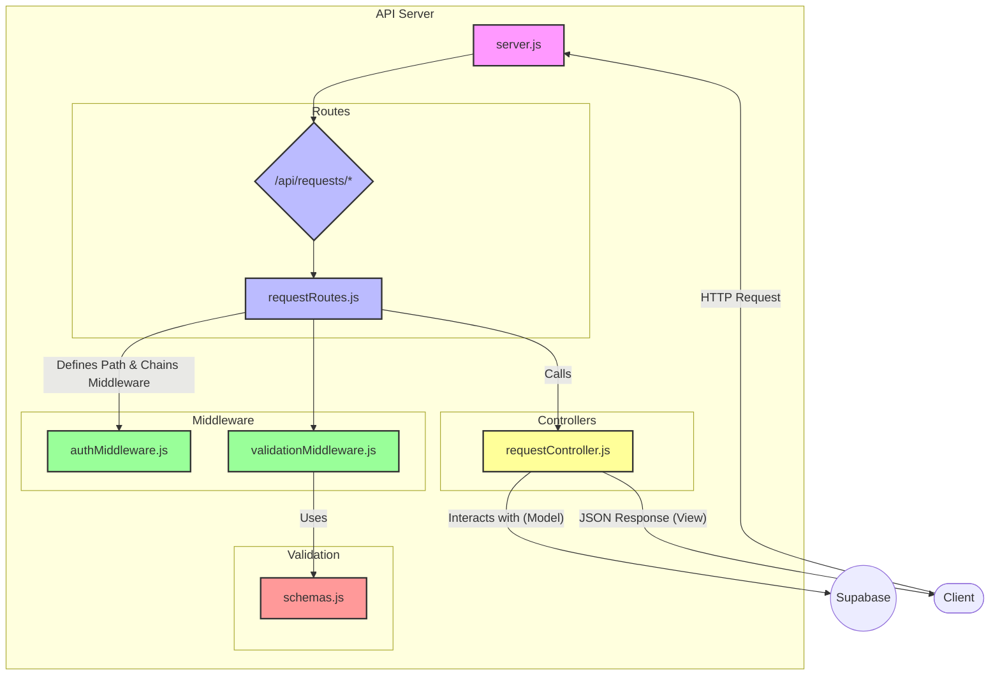
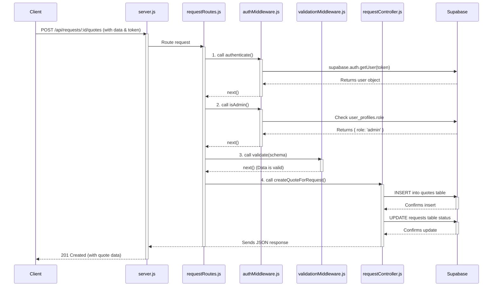
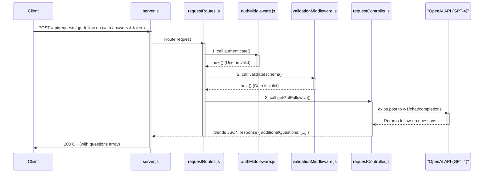

# PlumbingPOC API Server

This document outlines the architecture and conventions for the PlumbingPOC API server, built with Node.js and Express using an MVC-inspired pattern.

## Core Architecture: MVC Pattern

**Model:** Supabase handles all database interactions, data shaping, and enforces data integrity through its schema and Row Level Security (RLS) policies.

**View:** For a REST API, the "View" is the JSON data sent to the client. Controllers assemble and send these responses.

**Controller:** Contains the core business logic. Controllers receive requests from routes, interact with the Model (Supabase), and send a response back through the View (JSON).

---

## Directory Structure

```text
api/
├── controllers/           # Business logic (MVC: Controller)
│   └── requestController.js
├── middleware/            # Reusable functions before controllers
│   ├── authMiddleware.js
│   └── validationMiddleware.js
├── routes/                # Maps URLs to controllers
│   └── requestRoutes.js
├── validation/            # Data contracts (schemas)
│   └── schemas.js
└── server.js              # Main application entry point
```

## File Responsibilities

### `server.js`

- Initializes the Express app
- Configures core middleware (CORS, body-parser)
- Loads and delegates all API routes to the `routes/` directory
- Defines a global error handler
- Starts the server

### `/routes`

Defines endpoints (e.g., `/submit`, `/:requestId/notes`), specifies HTTP methods (GET, POST), and chains middleware before passing the request to the controller.

**Example from `requestRoutes.js`:**

```javascript
// Create a formal quote for a request (admin only)
router.post(
    '/:requestId/quotes', // The Path
    authenticate,         // Middleware 1: Is the user logged in?
    isAdmin,              // Middleware 2: Does the user have admin role?
    validate(createQuoteSchema), // Middleware 3: Is the request body valid?
    createQuoteForRequest // The Controller function to run
);
```

### `/controllers`

Self-contained business logic for specific tasks (e.g., submitting a quote, adding a note). Receives `req` and `res` after middleware.

### `/middleware`

Reusable functions between route and controller.
- `authMiddleware.js`: Handles authentication (`authenticate`) and role-based authorization (`isAdmin`).
- `validationMiddleware.js`: Generic `validate` function checks incoming request data against a schema.

### `/validation`

Defines "data contracts" using zod. Each schema in `schemas.js` clearly defines the expected shape and types for endpoint request bodies, params, or queries.

## Request Lifecycle

1. **Client Request:** React app sends a POST request to `/api/requests/:id/notes`.
2. **server.js:** Request hits `server.js`, passes through CORS and JSON body parser.
3. **routes/requestRoutes.js:** Router matches path/method, applies `authenticate` middleware and `addNote` controller.
4. **middleware/authMiddleware.js:** `authenticate` checks for valid JWT, attaches `req.user` and calls `next()`. If invalid, sends 401 Unauthorized and stops flow.
5. **controllers/requestController.js:** `addRequestNote` runs, interacts with Supabase, sends JSON response (e.g., `res.status(201).json(...)`).
6. **Client Receives Response:** React app receives JSON data or error message.

This clean separation makes the system robust and predictable.

## Mermaid diagrams

### relationship diagram


### Sequence Diagram Admin Creates a Quote (The Original Diagram)

### Sequence diagram AI Generates Follow-up Questions
